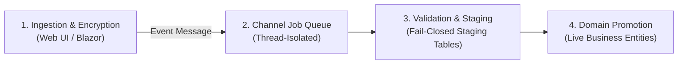
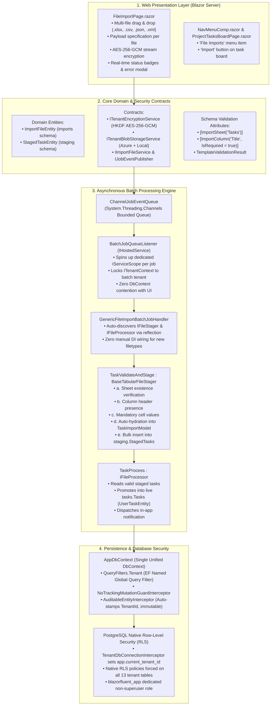

The Executive Summary

The latest uncommitted changes introduce a multi-tenant, client-side encrypted, asynchronous file ingestion and batch processing subsystem.

Instead of traditional synchronous uploads that block HTTP threads, parse directly into live tables, and risk cross-tenant pollution, this subsystem introduces a 4-stage decoupled pipeline:

Key Architectural Pillars

┌────────────────────────────────────────────────────────────────────────────────────────┐
│ 1. Zero-Knowledge Cryptographic Storage                                                │
│    • Hardware-accelerated AES-256-GCM authenticated stream encryption.                 │
│    • Per-tenant dynamic keys derived via HKDF-SHA256 (Tenant A cannot decrypt Tenant B)│
│    • Stored in tenant-partitioned blob directories (Local disk or Azure Blob Storage). │
└────────────────────────────────────────────────────────────────────────────────────────┘
                                    │
                                    ▼
┌────────────────────────────────────────────────────────────────────────────────────────┐
│ 2. Asynchronous Queue & Scope Isolation                                                │
│    • System.Threading.Channels in-memory bounded queue.                                │
│    • Batch worker executes in an isolated IServiceScope per job.                       │
│    • Zero DbContext contention with active Blazor Server circuits.                     │
└────────────────────────────────────────────────────────────────────────────────────────┘
                                    │
                                    ▼
┌────────────────────────────────────────────────────────────────────────────────────────┐
│ 3. Abstract Tabular Validation Engine (Excel & CSV)                                    │
│    • Declarative models: [ImportSheet("Tasks")], [ImportColumn("Title", IsRequired)]   │
│    • Auto-validates: (a) Sheet existence, (b) Header row presence, (c) Required cells. │
│    • Fail-Closed: Any missing header or required cell aborts staging (0 records saved).│
└────────────────────────────────────────────────────────────────────────────────────────┘
                                    │
                                    ▼
┌────────────────────────────────────────────────────────────────────────────────────────┐
│ 4. Two-Class Feature Packaging & Zero-Plumbing DI                                      │
│    • Each business import target needs strictly 2 classes: Stager & Processor.         │
│    • Assembly reflection scanning auto-registers handlers with zero manual DI changes. │
└────────────────────────────────────────────────────────────────────────────────────────┘
                                    │
                                    ▼
┌────────────────────────────────────────────────────────────────────────────────────────┐
│ 5. Defense-in-Depth Database Isolation (PostgreSQL Native RLS)                         │
│    • Connection opened -> Interceptor executes SET LOCAL app.current_tenant_id.        │
│    • PostgreSQL engine physically rejects cross-tenant operations via RLS policies.    │
└────────────────────────────────────────────────────────────────────────────────────────┘


# High-Level Architectural & Functional Overview

---

### The Executive Summary

The latest uncommitted changes introduce a **multi-tenant, client-side encrypted, asynchronous file ingestion and batch processing subsystem**. 

Instead of traditional synchronous uploads that block HTTP threads, parse directly into live tables, and risk cross-tenant pollution, this subsystem introduces a **4-stage decoupled pipeline**:



---

### Key Architectural Pillars

```
┌────────────────────────────────────────────────────────────────────────────────────────┐
│ 1. Zero-Knowledge Cryptographic Storage                                                │
│    • Hardware-accelerated AES-256-GCM authenticated stream encryption.                 │
│    • Per-tenant dynamic keys derived via HKDF-SHA256 (Tenant A cannot decrypt Tenant B)│
│    • Stored in tenant-partitioned blob directories (Local disk or Azure Blob Storage). │
└────────────────────────────────────────────────────────────────────────────────────────┘
                                    │
                                    ▼
┌────────────────────────────────────────────────────────────────────────────────────────┐
│ 2. Asynchronous Queue & Scope Isolation                                                │
│    • System.Threading.Channels in-memory bounded queue.                                │
│    • Batch worker executes in an isolated IServiceScope per job.                       │
│    • Zero DbContext contention with active Blazor Server circuits.                     │
└────────────────────────────────────────────────────────────────────────────────────────┘
                                    │
                                    ▼
┌────────────────────────────────────────────────────────────────────────────────────────┐
│ 3. Abstract Tabular Validation Engine (Excel & CSV)                                    │
│    • Declarative models: [ImportSheet("Tasks")], [ImportColumn("Title", IsRequired)]   │
│    • Auto-validates: (a) Sheet existence, (b) Header row presence, (c) Required cells. │
│    • Fail-Closed: Any missing header or required cell aborts staging (0 records saved).│
└────────────────────────────────────────────────────────────────────────────────────────┘
                                    │
                                    ▼
┌────────────────────────────────────────────────────────────────────────────────────────┐
│ 4. Two-Class Feature Packaging & Zero-Plumbing DI                                      │
│    • Each business import target needs strictly 2 classes: Stager & Processor.         │
│    • Assembly reflection scanning auto-registers handlers with zero manual DI changes. │
└────────────────────────────────────────────────────────────────────────────────────────┘
                                    │
                                    ▼
┌────────────────────────────────────────────────────────────────────────────────────────┐
│ 5. Defense-in-Depth Database Isolation (PostgreSQL Native RLS)                         │
│    • Connection opened -> Interceptor executes SET LOCAL app.current_tenant_id.        │
│    • PostgreSQL engine physically rejects cross-tenant operations via RLS policies.    │
└────────────────────────────────────────────────────────────────────────────────────────┘
```

---

### Detailed Functional Breakdown

#### 1. Ingestion & Cryptography (`FileImportPage` $\rightarrow$ `ImportFileService`)
* **Multi-File Batching**: A user drops single or multiple files (`.xlsx`, `.csv`, `.json`, `.xml`) in one batch. All files in the upload share a unified `ImportId` (Batch ID).
* **Per-Tenant Client Encryption**: Before files touch physical storage, streams are encrypted on-the-fly using **AES-256-GCM**. Encryption keys are derived per-tenant using **HKDF-SHA256** from a secure master key.
* **Non-Blocking UI**: Once files are written to storage and database tracking records are created, the service fires a lightweight `FileImportBatchJobEvent` and immediately releases the UI thread. The upload completes in milliseconds.

#### 2. Channel-Driven Queue & Execution Isolation (`Jobs` Subsystem)
* **Background Worker**: `BatchJobQueueListener` runs as a hosted background daemon listening to `System.Threading.Channels`.
* **Complete Memory Isolation**: The worker spins up a dedicated `IServiceScope` for each batch, resolves its own short-lived `AppDbContext`, and initializes a locked, unprivileged `ITenantContext` for that specific tenant. It never shares memory or `DbContext` instances with interactive Blazor Server circuits.

#### 3. Declarative Schema Validation (`BaseTabularFileStager`)
Instead of rewriting Excel OpenXML and CSV parsing boilerplate for every new file format, stagers inherit a reusable base engine:
1. **Sheet Name Verification**: For Excel workbooks, reads `xl/workbook.xml` to verify the sheet designated by `[ImportSheet("SheetName")]` exists. If missing, captures a structured error and continues inspection.
2. **Header Row Verification**: Inspects Row 1 to ensure all fields declared with `[ImportColumn("HeaderName")]` exist.
3. **Required Field Verification**: Scans rows 2..N to verify that fields marked `IsRequired = true` contain non-null, non-whitespace data.
4. **Automatic Hydration**: When validation passes, automatically converts cell text into strongly typed C# types (`DateTime`, `int`, `decimal`, `bool`, `enum`).
5. **Fail-Closed Diagnostics**: If any check fails, **zero rows are staged**. Cell-level errors (Sheet, Row, Column, Attempted Value, Error Message) are saved as JSON and viewable via the UI **Errors** diagnostics modal.

#### 4. Safe Intermediate Staging $\rightarrow$ Live Domain Promotion
* **Staging Table (`staging.StagedTasks`)**: Intermediate holding area holding valid, parsed records. Raw uploaded data never touches live production business tables directly.
* **Promotion (`TaskProcess`)**: Once all records in a file pass staging, the processor promotes valid staged rows into live domain entities (`tasks.Tasks`) in a single atomic database operation and dispatches completion notifications.

#### 5. Zero-Plumbing Developer Extensibility
Adding a future file type (e.g. Products, Customers, Invoices) requires:
1. Adding enum value to `ImportFileType`.
2. Creating a model decorated with `[ImportSheet]` and `[ImportColumn]`.
3. Creating **strictly 2 classes**:
   - `*ValidateAndStage.cs` (inherits `BaseTabularFileStager<TModel>`)
   - `*Process.cs` (implements `IFileProcessor`)
- **Zero DI changes**: The DI container uses assembly scanning to auto-discover and wire both classes on startup.
- **Zero runner changes**: `GenericFileImportBatchJobHandler` auto-routes files based on `.CanHandle(fileType)`.

#### 6. Database Layer Defense-in-Depth (PostgreSQL Native RLS)
* Added EF Core migration [`20261002235000_ApplyRowLevelSecurityPolicies`](file:///c:/Users/cheri/source/repos/BlazorFluent/BlazorFluent.Persistence/Migrations/20261002235000_ApplyRowLevelSecurityPolicies.cs):
  - Provisions a dedicated non-superuser role `blazorfluent_app`.
  - Enables and forces native **Row-Level Security (RLS)** across all 13 tenant tables.
  - Ensures the PostgreSQL engine physically drops cross-tenant reads or writes, even if application-level query filters were somehow bypassed.

  -------------------------------------------------------------------

  # Modular File Import, Encryption, Abstract Validation & Batch Subsystem

This document provides a single comprehensive architectural summary and execution plan of the multi-tenant file import, client-side encryption, abstract schema validation, and asynchronous batch processing subsystem for BlazorFluent.

---

## Architecture Overview



---

## 5-Layer Defense-in-Depth Security Matrix

| Layer | Component | Mechanism | Security Guarantee |
|---|---|---|---|
| **Layer 1: Context** | [`ITenantContext`](file:///c:/Users/cheri/source/repos/BlazorFluent/BlazorFluent.Core/Contracts/ITenantContext.cs) | Initialized per circuit/scope from authentication claims | Client users cannot switch tenants. Company users restricted to `AllowedTenants`. |
| **Layer 2: Application** | [`AppDbContext.cs`](file:///c:/Users/cheri/source/repos/BlazorFluent/BlazorFluent.Persistence/Context/AppDbContext.cs) | EF Core 10 Named Query Filter (`QueryFilters.Tenant`) | Automatically appends `WHERE TenantId = @tenant` on every query. Fail-closed: missing tenant evaluates to 0 rows. |
| **Layer 3: Save Guard** | [`AuditableEntityInterceptor.cs`](file:///c:/Users/cheri/source/repos/BlazorFluent/BlazorFluent.Persistence/Interceptors/AuditableEntityInterceptor.cs) | SaveChanges interception | Auto-stamps `TenantId` on insert; enforces `TenantId` immutability on update; throws `InvalidOperationException` on foreign tenant write attempts. |
| **Layer 4: Cryptography** | [`TenantAesGcmEncryptionService.cs`](file:///c:/Users/cheri/source/repos/BlazorFluent/BlazorFluent.Infrastructure/Security/TenantAesGcmEncryptionService.cs) | Hardware-accelerated AES-256-GCM + HKDF-SHA256 | Payloads are encrypted client-side with dynamic per-tenant keys before hitting disk/cloud. Tenant A cannot decrypt Tenant B. |
| **Layer 5: Database Engine** | [`MigrationBuilderRlsExtensions.cs`](file:///c:/Users/cheri/source/repos/BlazorFluent/BlazorFluent.Persistence/Extensions/MigrationBuilderRlsExtensions.cs) | PostgreSQL Native Row-Level Security (`FORCE ROW LEVEL SECURITY`) | PostgreSQL engine physically drops cross-tenant rows even if raw SQL is executed or EF query filters are bypassed. Dedicated runtime role `blazorfluent_app`. |

---

## Declarative Abstract Tabular Validation Pipeline

Instead of writing custom OpenXML and CSV parsers for every new file format, stagers inherit [`BaseTabularFileStager<TModel>`](file:///c:/Users/cheri/source/repos/BlazorFluent/BlazorFluent.Jobs/FileImports/Abstractions/BaseTabularFileStager.cs):

```csharp
[ImportSheet("Tasks")]
public class TaskImportModel
{
    public int RowIndex { get; set; }

    [ImportColumn("Title", IsRequired = true, ErrorMessage = "Task Title is mandatory.")]
    public string Title { get; set; } = string.Empty;

    [ImportColumn("Priority", IsRequired = false)]
    public string? Priority { get; set; }

    [ImportColumn("DueDate", IsRequired = false)]
    public DateTime? DueDate { get; set; }
}
```

### Automated Checks Performed Out-of-the-Box:
1. **Check a (Worksheet Name Verification)**:
   - For `.xlsx`: Reads `xl/workbook.xml`. Verifies the worksheet declared in `[ImportSheet]` exists. If missing, captures a structured error and continues inspection.
   - For `.csv`: Single tabular stream is automatically matched.
2. **Check b (Header Row Verification)**:
   - Reads Row 1. Verifies that all columns declared with `[ImportColumn]` are present in the file's header row.
3. **Check c (Mandatory Field Verification)**:
   - Scans rows 2..N. Verifies that any column with `IsRequired = true` contains non-null, non-whitespace data.
4. **Auto-Hydration**:
   - If all checks pass, converts cell values into strongly typed `TModel` instances (`DateTime`, `int`, `decimal`, `bool`, `enum`).
5. **Fail-Closed Execution**:
   - If any check fails, **0 rows are staged**. Cell-level diagnostics (`Sheet`, `RowIndex`, `ColumnName`, `ErrorMessage`, `AttemptedValue`) are serialized to `ValidationErrorsJson` and displayed in [`ImportErrorsModal.razor`](file:///c:/Users/cheri/source/repos/BlazorFluent/Modules/Imports/Components/ImportErrorsModal.razor).

---

## Developer Recipe: Adding a New Import Target (e.g. Products)

Adding a brand-new import target in the future requires **zero manual DI wiring** and **zero runner modifications**:

1. **Add Enum Value** in [`ImportTypes.cs`](file:///c:/Users/cheri/source/repos/BlazorFluent/BlazorFluent.Core/DataListTypes/ImportTypes.cs):
   ```csharp
   ProductExcel, ProductCsv
   ```
2. **Create Template Model** (e.g. `ProductImportModel.cs`):
   ```csharp
   [ImportSheet("Products")]
   public class ProductImportModel
   {
       [ImportColumn("SKU", IsRequired = true)]
       public string Sku { get; set; } = string.Empty;

       [ImportColumn("UnitPrice", IsRequired = true)]
       public decimal UnitPrice { get; set; }
   }
   ```
3. **Create Stager & Processor** in `BlazorFluent.Jobs/FileImports/Products/`:
   - `ProductValidateAndStage.cs` (inherits `BaseTabularFileStager<ProductImportModel>`).
   - `ProductProcess.cs` (implements `IFileProcessor`).
- **Result**: Assembly reflection scanning in [`JobsExtensions.cs`](file:///c:/Users/cheri/source/repos/BlazorFluent/BlazorFluent.Jobs/JobsExtensions.cs#L36-L37) automatically registers both classes into DI on application startup.

---

## User Review Required

> [!IMPORTANT]
> **PostgreSQL Superuser Bypass Rule**: In PostgreSQL, database superusers (`postgres`) and roles with the `BYPASSRLS` attribute inherently bypass RLS policies even when `FORCE ROW LEVEL SECURITY` is applied. 
> To guarantee RLS enforcement, application runtime queries will execute under a dedicated non-superuser role (`blazorfluent_app`), while `postgres` is reserved for schema migrations and administrative operations.

> [!NOTE]
> All code files are written, verified, and staged in Git (`git add -A`). No compiling or execution commands (`dotnet build`, `dotnet run`, `dotnet ef`) have been run by the assistant.

---

## Verification Plan

### Database Migration Update
Apply the pending migrations to your PostgreSQL database:

```bash
dotnet ef database update --project BlazorFluent.Persistence --startup-project BlazorFluent
```
*(Or `Update-Database -Project BlazorFluent.Persistence -StartupProject BlazorFluent` in Visual Studio Package Manager Console).*

This applies:
1. `20261002225329_ImportFileEntity`: Creates `imports.ImportFiles` and `staging.StagedTasks` tables.
2. `20261002235000_ApplyRowLevelSecurityPolicies`: Creates `blazorfluent_app` role and enables/forces RLS across all 13 tenant tables.

### Runtime Configuration
In `appsettings.json` (or `appsettings.Development.json`), set runtime database user to the non-superuser:
```json
"ConnectionStrings": {
  "DefaultConnection": "Host=localhost;Port=5432;Database=blazorfluent_db;Username=blazorfluent_app;Password=blazorfluent_app_password"
}
```

### Manual UI Flow Verification
1. Launch the application.
2. Click **File Imports** in the sidebar menu (or the **Import** button on the Tasks board header).
3. Select an active Project Workspace.
4. Upload a valid `.xlsx` or `.csv` task file.
   - Status badge transitions: `Uploaded` $\rightarrow$ `Validating` $\rightarrow$ `Staged` $\rightarrow$ `Processing` $\rightarrow$ `Completed`.
   - Verify records appear on the Tasks board (`/tasks`).
5. Upload an invalid file (e.g. missing `Title` column or empty sheet name):
   - Status transitions to `Validation Failed`.
   - Click the red **Errors** button to inspect the cell-level diagnostics in the modal.
   - Verify that 0 rows were staged in `staging.StagedTasks` (strict fail-closed policy).
