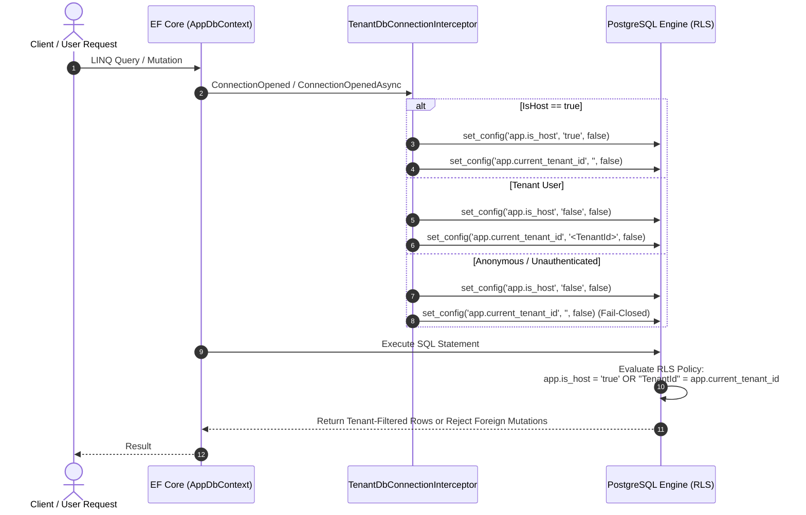

# Implementation Plan: PostgreSQL Native Row-Level Security (RLS) Defense-in-Depth

This plan formalizes the implementation of Layer 5 defense-in-depth: PostgreSQL Native Row-Level Security (RLS). This ensures that PostgreSQL physically rejects cross-tenant reads, inserts, updates, and deletes at the database engine level, even if C# query filters are bypassed.

## User Review Required

> [!IMPORTANT]
> **PostgreSQL Superuser Bypass Rule**: In PostgreSQL, database superusers (`postgres`) and roles with the `BYPASSRLS` attribute inherently bypass RLS policies even when `FORCE ROW LEVEL SECURITY` is applied. 
> To guarantee RLS enforcement, application runtime queries will execute under a dedicated non-superuser role (`blazorfluent_app`), while `postgres` is reserved for schema migrations and administrative operations.

> [!NOTE]
> As requested by the user, **no build, compilation, or execution commands** (`dotnet build`, `dotnet run`, `dotnet ef`) will be run by the assistant. All verification commands will be clearly provided for the user to execute.

---

## Architectural Workflow

---
