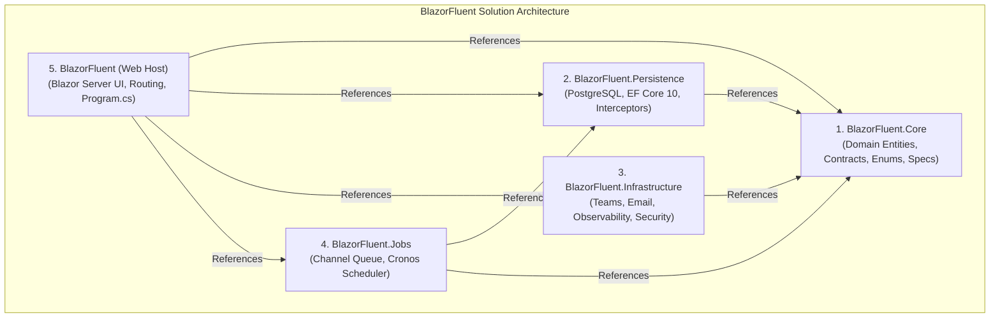

# Solution Architecture & Folder Structure Guide

## 1. Solution Topology & Project Dependencies



---

## 2. Project-by-Project Folder Breakdown

### 📦 1. `BlazorFluent.Core` (Domain & Contracts Project)
* **Layer Role**: Innermost domain ring (Clean Architecture).
* **Dependencies**: `Microsoft.Extensions.Logging.Abstractions`, `FluentValidation`.
* **Coupling Rules**: Zero dependency on EF Core, UI frameworks, or HTTP infrastructure.

```
BlazorFluent.Core/
├── Common/                          # Shared domain DTO envelopes & query constants
│   ├── AuditTrailFilter.cs          # Query filter model for audit trail pagination
│   ├── DateTimeSettings.cs          # Timezone preference settings (UTC vs Local)
│   ├── NotificationRequests.cs      # DTOs for notification commands and queries
│   ├── PagedResult.cs               # Generic paginated result envelope PagedResult<T>
│   ├── ProjectAuthorizationExtensions.cs # LINQ extensions for ProjectRole evaluation
│   ├── QueryFilters.cs              # EF Core named query filter string constants
│   └── Result.cs                    # Functional Result and Result<T> monads
├── Contracts/                       # Domain service contracts & interfaces
│   ├── IAuditService.cs             # Forensic audit logging service contract
│   ├── ICurrentUser.cs              # Active user claims & impersonation context
│   ├── IDateTimeProvider.cs         # Timezone-aware date/time provider contract
│   ├── IEmailNotificationSender.cs  # Outbound SMTP email sender contract
│   ├── IImpersonationService.cs     # Operator impersonation management contract
│   ├── INotificationService.cs      # In-app notification engine contract
│   ├── IProjectAuthorizationService.cs # Project role check service contract
│   ├── ITeamsNotificationSender.cs  # Outbound Teams webhook sender contract
│   ├── ITenantCacheService.cs       # Multi-tenant cache invalidation contract
│   ├── ITenantContext.cs            # Active tenant context provider contract
│   ├── ITenantService.cs            # Tenant administration contract
│   ├── IUnitOfWork.cs               # Atomic transaction & rollback contract
│   └── IUserSessionService.cs       # Real-time session revocation contract
├── DataListTypes/                   # Domain enums, role definitions & value types
│   ├── AuditTypes.cs                # Audit event types and severity scales
│   ├── JobTypes.cs                  # Job execution status and trigger types
│   ├── NotificationTypes.cs         # Notification categories, severity & channels
│   ├── ProjectRole.cs               # Project permissions hierarchy (ReadOnly, QA, Dev, Admin)
│   ├── Roles.cs                     # Platform role string constants
│   └── TenantTypes.cs               # User type classifications (CompanyUser vs ClientUser)
├── Domain/                          # Pure POCO domain entity definitions
│   ├── Auditing/
│   │   └── AuditRecordEntity.cs     # Forensic audit trail record (schema: audit)
│   ├── Catalog/
│   │   └── ProductEntity.cs         # Sample product catalog entity (schema: catalog)
│   ├── Delegates/                   # Entity marker interfaces & abstract base classes
│   │   ├── AuditableEntity.cs       # Base class for auditable entities
│   │   ├── BaseEntity.cs            # Base class with sequential UUIDv7 primary key
│   │   ├── IAuditableEntity.cs      # Audit property contract (Created, Updated)
│   │   ├── IAuditExemptEntity.cs    # Marker to prevent recursive auditing
│   │   ├── IGlobalEntity.cs         # Marker for cross-tenant un-filtered entities
│   │   ├── IProjectScopedEntity.cs  # Marker for project-restricted entities
│   │   ├── ISoftDeletableEntity.cs  # Soft-delete property contract
│   │   ├── ITenantEntity.cs         # Tenant isolation property contract
│   │   └── TenantAuditableEntity.cs # Base class combining tenant & audit fields
│   ├── Identity/
│   │   ├── ImpersonationGrantEntity.cs # SuperAdmin impersonation record (schema: identity)
│   │   ├── UserEntity.cs            # Whitelisted user record with HMAC seal (schema: identity)
│   │   └── UserSessionEntity.cs     # Live user circuit session record (schema: identity)
│   ├── Jobs/
│   │   └── JobExecutionEntity.cs    # Background job execution history (schema: jobs)
│   ├── Notifications/
│   │   └── NotificationEntity.cs    # Three-tier segmented notification (schema: notifications)
│   └── Tenancy/
│       ├── ProjectEntity.cs         # Tenant project workspace (schema: tenancy)
│       ├── ProjectUserRoleEntity.cs # Project membership role assignment (schema: tenancy)
│       └── TenantEntity.cs          # Multi-tenant company scope (schema: tenancy)
├── Events/                          # In-process background job events
│   └── IJobEvent.cs                 # Base IJobEvent interface and BaseJobEvent record
└── Validation/                      # Declarative input validators (FluentValidation)
    └── NotificationRequestValidator.cs # SendNotificationRequest validation rules
```

---

### 📦 2. `BlazorFluent.Persistence` (Data Access Project)
* **Layer Role**: 100% pure database persistence layer.
* **Dependencies**: `BlazorFluent.Core`, `Microsoft.EntityFrameworkCore`, `Npgsql.EntityFrameworkCore.PostgreSQL`, `Microsoft.Extensions.Caching.Hybrid`, `Microsoft.Extensions.Caching.StackExchangeRedis`, `Microsoft.AspNetCore.DataProtection.EntityFrameworkCore`.
* **Coupling Rules**: Restrict to PostgreSQL, DbContext, EF Configurations, interceptors, and data repositories. Zero external HTTP/SMTP senders.

```
BlazorFluent.Persistence/
├── Configurations/                  # EF Core IEntityTypeConfiguration<T> mappings
│   ├── Auditing/
│   │   └── AuditRecordEntityConfiguration.cs
│   ├── Catalog/
│   │   └── ProductEntityConfiguration.cs
│   ├── Identity/
│   │   ├── ImpersonationGrantEntityConfiguration.cs
│   │   ├── UserEntityConfiguration.cs
│   │   └── UserSessionEntityConfiguration.cs
│   ├── Notifications/
│   │   └── NotificationEntityConfiguration.cs
│   └── Tenancy/
│       ├── ProjectEntityConfiguration.cs
│       ├── ProjectUserRoleEntityConfiguration.cs
│       └── TenantEntityConfiguration.cs
├── Context/                         # EF Core DbContext mapping DbSets & Query Filters
│   └── AppDbContext.cs              # Maps DbSets, configures QueryFilters.Tenant & SoftDelete
├── Interceptors/                    # EF Core SaveChanges pipeline interceptors
│   ├── AuditableEntityInterceptor.cs # Manages audit dates, HMAC seals, soft-deletes & diffs
│   └── ProjectSecurityInterceptor.cs # Fail-closed EF Core security net for IProjectScopedEntity
├── Services/                        # Database-backed service implementations
│   ├── AuditService.cs              # Queries and logs forensic audit records
│   ├── ImpersonationService.cs      # Manages SuperAdmin impersonation grants
│   ├── NotificationService.cs       # Stores notifications in PostgreSQL and triggers senders
│   ├── ProjectAuthorizationService.cs # Resolves & caches project permissions via HybridCache
│   ├── TenantHybridCacheService.cs  # High-performance L1/L2 tenant cache invalidation
│   ├── TenantService.cs             # Manages tenant lifecycle and company metadata
│   ├── UnitOfWork.cs                # Atomic DbContext commit & rollback manager
│   └── UserSessionService.cs        # Manages identity.UserSessions and revocation keys
└── PersistenceExtensions.cs         # Service collection registration AddPersistence()
```

---

### 📦 3. `BlazorFluent.Infrastructure` (External Integrations & Web Middleware Project)
* **Layer Role**: Outbound integrations, observability circuit handlers, and security middleware.
* **Dependencies**: `BlazorFluent.Core`, `Microsoft.AspNetCore.App` (FrameworkReference).

```
BlazorFluent.Infrastructure/
├── Notifications/                   # Outbound external notification dispatchers
│   ├── EmailNotificationSender.cs   # Outbound SMTP email delivery sender
│   └── TeamsNotificationSender.cs   # Outbound Microsoft Teams MessageCard HTTP webhook sender
├── Observability/                   # Blazor Circuit observability handlers
│   └── BlazorCircuitObservabilityHandler.cs # CircuitHandler tracking connections & durations
├── Security/                        # HTTP security headers & authorization result handlers
│   ├── PathAwareAuthorizationHandler.cs # IAuthorizationMiddlewareResultHandler bypassing public paths
│   └── SecurityHeadersExtensions.cs # Injects CSP, Clickjacking, MIME & Referrer headers
└── InfrastructureExtensions.cs      # Service collection registration AddInfrastructure()
```

---

### 📦 4. `BlazorFluent.Jobs` (Background Processing Engine Project)
* **Layer Role**: Zero-polling background queueing and cron execution engine.
* **Dependencies**: `BlazorFluent.Core`, `BlazorFluent.Persistence`, `Cronos`, `Microsoft.Extensions.Hosting`.

```
BlazorFluent.Jobs/
├── Abstractions/                    # Background job engine interfaces
│   ├── IBatchJobHandler.cs          # Generic batch job handler interface IBatchJobHandler<T>
│   └── IJobEventQueue.cs            # In-memory channel queue interface
├── Jobs/                            # Concrete job event & batch handler definitions
│   ├── Audit/
│   │   ├── AuditPurgeJobEvent.cs    # Nightly audit purge job event
│   │   └── AuditPurgeJobHandler.cs  # Bulk ExecuteDeleteAsync audit purge handler
│   └── Catalog/
│       ├── CatalogSyncBatchJobHandler.cs
│       ├── CatalogSyncJobEvent.cs   # Sample catalog sync job event
│       └── CatalogSyncJobHandler.cs # Sample catalog sync batch handler
├── Listeners/                       # Background queue consumer hosted service
│   └── BatchJobQueueListener.cs     # Worker thread consuming Channel queue with backoff
├── Queue/                           # High-performance in-memory channel implementation
│   └── ChannelJobEventQueue.cs      # System.Threading.Channels.Channel<IJobEvent> queue
├── Schedulers/                      # Zero-polling cron scheduler
│   └── PeriodicBatchScheduler.cs    # Cronos scheduler for CatalogSync and AuditPurge
├── Services/                        # Dashboard query service
│   └── JobManagerService.cs         # Queries JobExecutionEntity for the /jobs UI dashboard
└── JobsExtensions.cs                # Service collection registration AddBackgroundJobs()
```

---

### 📦 5. `BlazorFluent` (Main Web Application Host Project)
* **Layer Role**: Interactive Server Blazor WebApp host, Razor pages, modules, layout, and composition root.
* **Dependencies**: `BlazorFluent.Core`, `BlazorFluent.Persistence`, `BlazorFluent.Infrastructure`, `BlazorFluent.Jobs`, `Microsoft.FluentUI.AspNetCore.Components`, `Blazored.FluentValidation`, `Serilog.AspNetCore`, `Azure.Monitor.OpenTelemetry.AspNetCore`.

```
BlazorFluent/
├── Components/                      # Presentation components & routing shell
│   ├── App.razor                    # Root HTML document shell (meta tags, script imports)
│   ├── Routes.razor                 # Blazor router component with error boundary wrappers
│   ├── _Imports.razor               # Global Razor directive imports
│   ├── Common/                      # Reusable presentation components
│   │   ├── AppErrorBoundary.razor   # Root component error boundary displaying ERR-XXXXXXXX
│   │   ├── AuthorizedPageComponentBase.cs # Page base class enforcing MinimumVisitRole
│   │   ├── ConfirmDialog.razor      # Accessible modal confirmation for destructive actions
│   │   ├── EmptyState.razor         # Standardized empty data table indicator card
│   │   ├── ImpersonationBanner.razor # Pinned top banner for active SuperAdmin impersonation
│   │   ├── ObservabilityErrorBoundary.razor # Circuit logging error boundary
│   │   ├── PageHeader.razor         # Standardized header with title, subtitle & action slot
│   │   ├── ProjectAccessDeniedCard.razor # Access denied card for unauthorized projects
│   │   ├── ProjectAuthorizeView.razor # Role-gated content wrapper component
│   │   └── SessionRevokedModal.razor # Watchdog freezing circuit upon session revocation
│   ├── Layout/                      # Application shell layouts
│   │   ├── MainLayout.razor         # Primary app layout with header, nav & notifications
│   │   ├── NavMenu.razor            # Sidebar navigation links
│   │   ├── NotificationBell.razor   # Header bell badge with segmented tabs
│   │   ├── ReconnectModal.razor     # SignalR reconnection modal
│   │   └── TenantSwitcher.razor     # Header tenant switching dropdown
│   └── Pages/                       # Root application route views
│       ├── AuthError.razor          # Minimal /auth-error access denied view
│       ├── Counter.razor            # Sample counter component view
│       ├── Error.razor              # Hardened /Error page displaying incident ID
│       ├── Home.razor               # Application homepage view
│       ├── Login.razor              # Corporate /login page with Privacy Notice
│       ├── NotFound.razor           # 404 /not-found page view
│       └── Weather.razor            # Sample weather table view
├── Infrastructure/Security/         # Presentation authentication state providers
│   ├── AppCurrentUser.cs            # Scoped mutable implementation of ICurrentUser
│   └── CurrentUserAuthenticationStateProvider.cs # Scoped AuthenticationStateProvider
├── Modules/                         # Feature-sliced admin dashboard modules
│   ├── _Imports.razor
│   ├── Auditing/Pages/
│   │   └── AuditTrailDashboard.razor # Forensic audit trail grid (/auditing/audit-trail)
│   ├── Catalog/Pages/
│   │   └── CatalogDashboard.razor   # Product catalog grid (/catalog)
│   ├── Jobs/Pages/
│   │   └── JobsDashboard.razor      # Job engine resilience dashboard (/jobs)
│   └── Tenancy/Pages/
│       ├── ActiveSessionsDashboard.razor # Active user sessions dashboard (/admin/sessions)
│       ├── ProjectRoleManagement.razor   # Project permissions dashboard (/tenancy/project-roles)
│       ├── ProjectsDashboard.razor       # Project management dashboard (/tenancy/projects)
│       └── TenantManagement.razor        # Tenant management dashboard (/tenancy/tenants)
├── Properties/                      # Local launch profile settings
│   └── launchSettings.json
├── wwwroot/                         # Public static web assets
│   ├── app.css
│   └── favicon.ico
├── Program.cs                       # Composition root (Serilog, Key Vault, Auth, Headers, Pipeline)
└── appsettings.json                # Application configuration file
```

---

## 3. Summary of Project Responsibilities

| Project | Primary Focus | Forbidden Contents |
|---|---|---|
| **`BlazorFluent.Core`** | Domain entities, interfaces, enums, specs | No EF Core, no UI, no HTTP clients |
| **`BlazorFluent.Persistence`** | PostgreSQL DbContext, EF mappings, interceptors, data services | No HTTP/SMTP senders, no Razor components |
| **`BlazorFluent.Infrastructure`** | Teams webhooks, SMTP emails, circuit handlers, security headers | No DbContext or EF Core entity configurations |
| **`BlazorFluent.Jobs`** | Channel queue, Cronos scheduler, batch handlers | No Web/UI presentation components |
| **`BlazorFluent`** | Blazor Server UI, pages, routing, middleware pipeline, Program.cs | No DB mappings or entity definitions |
