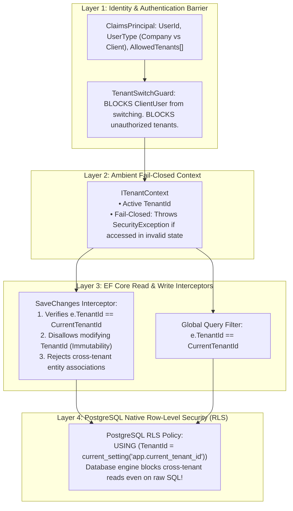
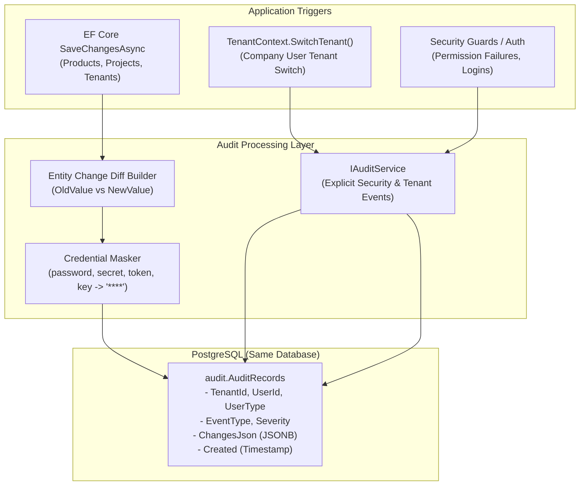

<div align="center">

# ⚡ BlazorFluent .NET 10 Starter Kit


--------------------------
# Enterprise Tenant Security: Frameworks vs. Custom Architecture

This document addresses your critical security requirement: **protecting tenant boundaries with the highest rigor to prevent hacking, data breaches, and cross-tenant data leakage**, comparing existing popular .NET frameworks against a custom defense-in-depth architecture.

> [!IMPORTANT]
> **Strict Operational Rule**:
> The assistant will **NEVER** run `dotnet build`, `dotnet compile`, or `dotnet run`. All compilation, building, and running tasks will be performed exclusively by the **user** at the end.

---

## 1. The Real Threat Model: How Multitenant Breaches Happen

To evaluate frameworks vs. custom code, we must understand the actual attack vectors that lead to multitenant data breaches:

| Vulnerability Vector | How Attackers Exploit It | Does a Framework (like Finbuckle) Stop It? |
| :--- | :--- | :--- |
| **IDOR (Insecure Direct Object Reference)** | Attacker changes `ProjectId=123` to `ProjectId=456` in an API call or Blazor event to fetch another tenant's project. | ⚠️ **Only if** developer remembers to filter by tenant in query. |
| **Cross-Tenant Write Tampering** | Attacker sends an update payload altering `TenantId` to transfer an entity or create records inside another tenant. | ❌ **No**. Finbuckle has zero write-interception or tenant immutability protection. |
| **Bypassed Query Filter** | Developer runs raw SQL (`FromSqlRaw`, Dapper), uses `.IgnoreQueryFilters()`, or loads child navigation properties. | ❌ **No**. Application-level query filters are completely bypassed. |
| **Tenant Switching Privilege Escalation** | Client user tampers with headers (`X-Tenant-Id`) or cookies to impersonate another client's company. | ❌ **No**. Frameworks blindly resolve the header without verifying user-tenant authorization. |
| **Stale Blazor SignalR Circuits** | In Blazor Server, `HttpContext` drops after WebSocket handshake. Framework loses tenant context or falls back to host. | ❌ **No**. Causes unpredictable tenant leaks or runtime crashes. |

---

## 2. Custom Defense-in-Depth Architecture (Recommended)
- **What it is**: An enterprise security model used by top SaaS providers (Stripe, GitHub, Microsoft).
- **The Reality**:
  - Built on the principle of **Defense-in-Depth**: No single layer failure can cause a data breach.
  - **Layer 1 (Identity)**: Cryptographically verified user type (`CompanyUser` vs. `ClientUser`) and permitted tenant whitelist.
  - **Layer 2 (Context)**: Fail-closed ambient context (`ITenantContext`). If no tenant is active, all tenant data operations abort immediately.
  - **Layer 3 (EF Core Interceptor)**: Strict write-barrier preventing cross-tenant creation or updates, with immutable `TenantId`.
  - **Layer 4 (EF Core Query Filter)**: Automatic query isolation.
  - **Layer 5 (Optional Database Hardening)**: PostgreSQL Native **Row-Level Security (RLS)** — the database engine itself physically blocks cross-tenant reads even if an attacker executes raw SQL!




---

## 4. How the Custom Security Architecture Prevents Breaches

### 1. Stopping Cross-Tenant Write Attacks (Interceptor Level)
```csharp
// In AuditableEntityInterceptor:
if (entry.Entity is ITenantEntity tenantEntity)
{
    if (entry.State == EntityState.Added)
    {
        // Fail-closed: Cannot save a tenant entity without an active tenant
        if (string.IsNullOrWhiteSpace(_tenantContext.TenantId) && !_tenantContext.IsHost)
        {
            throw new SecurityException("CRITICAL: Attempted to insert a tenant entity without an active tenant context.");
        }

        // Auto-assign or verify matches active tenant
        if (string.IsNullOrWhiteSpace(tenantEntity.TenantId))
        {
            tenantEntity.TenantId = _tenantContext.TenantId!;
        }
        else if (tenantEntity.TenantId != _tenantContext.TenantId && !_tenantContext.IsHost)
        {
            throw new SecurityException($"CRITICAL: Cross-tenant write detected! Entity has TenantId '{tenantEntity.TenantId}', but session is '{_tenantContext.TenantId}'.");
        }
    }
    else if (entry.State == EntityState.Modified)
    {
        // TenantId is IMMUTABLE. Once written, it can never be changed.
        entry.Property(nameof(ITenantEntity.TenantId)).IsModified = false;

        var originalTenant = (string)entry.Property(nameof(ITenantEntity.TenantId)).OriginalValue!;
        if (originalTenant != _tenantContext.TenantId && !_tenantContext.IsHost)
        {
            throw new SecurityException($"CRITICAL: Cross-tenant modification detected! Record belongs to '{originalTenant}', but session is '{_tenantContext.TenantId}'.");
        }
    }
}
```

### 2. Stopping Tenant-Switching Hacking (Context Level)
```csharp
public Result SwitchTenant(string newTenantId)
{
    // Client users are HARD-BLOCKED at the domain level
    if (UserType == UserType.ClientUser)
    {
        return Result.Failure("SECURITY VIOLATION: Client users are strictly prohibited from switching tenants.");
    }

    // Company users can only switch to tenants they are authorized to access
    if (!IsHost && !AllowedTenants.Any(t => t.Id == newTenantId))
    {
        return Result.Failure($"SECURITY VIOLATION: User is not authorized to access tenant '{newTenantId}'.");
    }

    _activeTenantId = newTenantId;
    return Result.Success();
}
```

### 3. Ultimate Breach Protection: PostgreSQL Row-Level Security (RLS)
For maximum data breach prevention against SQL injection, Dapper leaks, or reporting bugs:
In PostgreSQL:
```sql
-- Enable Row Level Security on all tenant tables
ALTER TABLE catalog."Products" ENABLE ROW LEVEL SECURITY;

-- Create policy that enforces tenant matching
CREATE POLICY tenant_isolation_policy ON catalog."Products"
    FOR ALL
    USING ("TenantId" = current_setting('app.current_tenant_id', true));
```
When `AppDbContext` opens a connection:
```sql
SET app.current_tenant_id = 'tenant-guid-here';
```
Even if an attacker finds an SQL injection vulnerability or executes raw queries, PostgreSQL will physically return 0 rows from other tenants!

IGlobalEntity (Crucial): Protects your #1 security priority. It switches your EF Core filters from opt-in to default-on. If a developer adds a new entity tomorrow and forgets the tenant base class, EF Core will still isolate it automatically. Only entities explicitly marked IGlobalEntity (like TenantEntity itself) bypass the filter.
--------------------------
# Implementation Plan: Detailed Forensic Auditing (Level 2 & 3)

## 1. Goal Description

Implement a comprehensive, enterprise-grade auditing system in **BlazorFluent** targeting the **same PostgreSQL database under a dedicated `audit` schema** with **indefinite retention**.

This elevates auditing from **Level 1** (basic row stamps `Created`/`Updated`) to:
1. **Level 2 (Property-Level Entity Diffs)**: Automatic before-and-after property change capture in JSON format on every EF Core `Insert`, `Update`, and `Delete`, with automated masking of credentials, tokens, and secrets.
2. **Level 3 (Security & Activity Trail)**: Explicit logging of tenant switches, login/permission events, and critical user operations.

---

## 2. User Review Required

> [!IMPORTANT]
> **Transactional vs. Decoupled Auditing**:
> Entity change audits are captured directly within the same database transaction in the `audit.AuditRecords` table. This ensures 100% transactional consistency (if a database save fails or rolls back, phantom audit records are never saved).

> [!NOTE]
> **Schema Isolation**:
> The `audit.AuditRecords` table lives in its own PostgreSQL schema (`audit`), keeping application domain tables (`catalog`, `tenancy`) clean and uncluttered.

---

## 3. Architecture & Data Flow



------------------------------------------

# Implementation Plan: Caching Architecture Specification (L1 vs. L2 & README Documentation)

## Goal Description
Document and clarify the precise mechanics of **L1 (In-Process Memory)** vs. **L2 (Distributed Cache - Redis / Memory Fallback)** within the BlazorFluent architecture, including:
1. Exactly what data is stored in L1 vs. L2.
2. How .NET 10 `HybridCache` coordinates synchronization, serialization, and invalidation between L1 and L2 across auto-scaled Azure Web App instances.
3. An explicit inventory of cached items vs. non-cached business items.
4. A copy-ready, production-grade section to be integrated into `README.md`.

---

## User Review Required

> [!NOTE]
> **How HybridCache Coordinates L1 and L2**:
> In .NET 10 `HybridCache`, every cached item exists in **both** L1 and L2, but with fundamentally different representations, lifetimes, and purposes:
> - **L1 (In-Process RAM)** stores **live C# object references** in local instance memory for **sub-microsecond access**.
> - **L2 (Distributed Tier)** stores **serialized binary/JSON payloads** in Redis (or shared memory) with longer TTLs, serving as the **single source of truth** across auto-scaled instances and the **pub/sub invalidation backplane**.

---

## L1 vs. L2 Deep-Dive Specification

| Dimension | L1: In-Process Memory Cache | L2: Distributed Cache (Redis / Valkey) |
| :--- | :--- | :--- |
| **Location** | Local RAM of the specific Azure Web App node | Remote shared Redis instance (or in-memory fallback for local dev) |
| **Storage Format** | Unserialized live .NET object instances | Serialized binary / JSON byte buffers |
| **Access Latency** | **~50 to 100 nanoseconds** (Zero network hops, zero deserialization) | **~0.5 to 1.5 milliseconds** (Network round-trip across same Azure VNet) |
| **Default Lifetime** | Short (`LocalCacheExpirationMinutes = 15`) | Longer (`DefaultExpirationMinutes = 60`) |
| **Scope** | Private to the current instance and circuit | Shared across all auto-scaled Azure instances |
| **Eviction Mechanism** | Local TTL expiration OR instant eviction via Redis Pub/Sub message | Absolute TTL, LRU eviction, or atomic tag invalidation (`RemoveByTagAsync`) |

---

## Data Inventory: What is Cached vs. Excluded

### 1. Cached Payloads (Infrastructure Hotspots Only)

| Cache Scope | Key Pattern | Payload Type | L1 TTL | L2 TTL | Invalidation Trigger |
| :--- | :--- | :--- | :---: | :---: | :--- |
| **Global (Host)** | `g:tenants:all` | `IReadOnlyList<TenantEntity>` (Slug, DisplayName, StartDate, EndDate, IsActive) | 15 min | 60 min | Tenant created, edited, dates changed, or status toggled |
| **Tenant-Scoped** | `t:{tenantId}:permissions:{userId}` | `IReadOnlyList<string>` (User permission claims & role grants) | 15 min | 60 min | User role change, permission revocation |
| **Tenant-Scoped** | `t:{tenantId}:settings` | `TenantSettingsDto` (Branding, theme colors, feature flags) | 15 min | 60 min | Tenant settings modified, or tenant deactivated |

### 2. Intentionally Non-Cached Payloads (Direct to PostgreSQL)

| Entity / Query | Why It Is Excluded From Cache |
| :--- | :--- |
| **Catalog Products (`ProductEntity`)** | High cardinality, search/filter variants, and pagination. Querying PostgreSQL with `.AsNoTracking()` takes **1-3ms**. Caching would introduce stale-data bugs without user-perceived gain. |
| **Audit Records (`AuditRecordEntity`)** | Write-heavy, chronological append-only audit stream. Caching audit tables is an anti-pattern. |
| **User Profile / Form Edits** | Interactive transactional updates; must always reflect the absolute latest state from the database. |

---

## Proposed Changes: Section to Append to `README.md`

Below is the exact documentation markdown to be added to `README.md`:

```markdown
------------------------------------------
# Multi-Tenant Caching Architecture (L1 vs. L2 & Azure Auto-Scaling)

BlazorFluent implements a high-performance, fail-closed multi-tenant caching architecture based on **.NET 10 HybridCache (`Microsoft.Extensions.Caching.Hybrid`)** and **FullStackHero surgical caching patterns**.

## 1. Two-Tier Cache Topology (L1 vs. L2)

```
                            Azure ARR Load Balancer
                                       │
                ┌──────────────────────┴──────────────────────┐
                ▼                                             ▼
       Azure Web App (Node 1)                        Azure Web App (Node 2)
  ┌───────────────────────────────┐             ┌───────────────────────────────┐
  │ L1 Cache: In-Process RAM      │             │ L1 Cache: In-Process RAM      │
  │ • Live C# object references   │             │ • Live C# object references   │
  │ • Latency: ~50-100 ns         │             │ • Latency: ~50-100 ns         │
  │ • TTL: 15 minutes             │             │ • TTL: 15 minutes             │
  └───────────────┬───────────────┘             └───────────────┬───────────────┘
                  │                                             │
                  │        Redis Invalidation Bus (Pub/Sub)     │
                  ├─────────────────────────────────────────────┤
                  │                                             │
                  ▼                                             ▼
  ┌─────────────────────────────────────────────────────────────────────────────┐
  │ L2 Cache: Azure Cache for Redis (or Valkey / DistributedMemoryCache in dev) │
  │ • Serialized shared byte payload                                            │
  │ • Latency: ~0.8-1.5 ms (intra-VNet)                                         │
  │ • TTL: 60 minutes                                                           │
  │ • Broadcasts real-time L1 eviction across all auto-scaled nodes              │
  └──────────────────────────────────────┬──────────────────────────────────────┘
                                         │
                                         ▼
  ┌─────────────────────────────────────────────────────────────────────────────┐
  │                 PostgreSQL (Azure Flexible Server / Local)                  │
  │ • Ground truth database with Tenant Isolation Filters                       │
  │ • DataProtectionKeys table (shared token encryption across all nodes)       │
  └─────────────────────────────────────────────────────────────────────────────┘
```

### L1 (In-Process Memory)
- **What is stored**: Unserialized, live C# object references residing directly in the web application's memory heap.
- **Speed**: **Sub-microsecond (<100 nanoseconds)**. Zero network hops, zero JSON/binary serialization overhead.
- **Lifecycle**: Managed by `LocalCacheExpirationMinutes` (default: 15 minutes). Evicted immediately if an invalidation message arrives via Redis.

### L2 (Distributed Tier)
- **What is stored**: Serialized byte payloads accessible to all application instances.
- **Speed**: **~0.5 to 1.5 milliseconds** within the same Azure VNet or AWS VPC.
- **Lifecycle**: Managed by `DefaultExpirationMinutes` (default: 60 minutes).
- **Dual-Mode Operation**:
  - **Local Development**: Defaults to `DistributedMemoryCache` ($0 external setup, no Redis required).
  - **Azure Production**: Supplying `ConnectionStrings:Redis` automatically turns on `StackExchangeRedisCache`.

---

## 2. What Is Cached vs. What Is Not

To avoid cache-invalidation bugs and stale-data hazards, BlazorFluent follows the **Surgical Caching Pattern**:

### ✅ What IS Cached (Infrastructure Hotspots Only)
1. **Global Tenant Directory (`g:tenants:all`)**:
   - The complete tenant metadata list (`TenantEntity`).
   - Queried during route resolution, tenant switching, and host management.
   - Evicted automatically on tenant creation, status change, or date update.
2. **Tenant Permissions & Claims (`t:{tenantId}:permissions:{userId}`)**:
   - Authorized roles and permission flags checked on every UI interaction.
   - Evicted when user permissions change.
3. **Tenant Customization (`t:{tenantId}:settings`)**:
   - Tenant branding, custom themes, and configuration flags.

### ❌ What is NOT Cached (Direct PostgreSQL Queries)
- **Business Entities (`Products`, `Orders`, etc.)**: Kept direct from PostgreSQL using EF Core `.AsNoTracking()`. PostgreSQL executes indexed queries in **1-3ms**, ensuring zero risk of stale business data.
- **Forensic Audit Trails (`audit.AuditRecords`)**: Strictly append-only write path; never cached.

---

## 3. Multi-Tenant Security & Atomic Eviction

1. **Fail-Closed Facade (`ITenantCacheService`)**:
   - Automatically prefixes keys: `t:{tenantId}:{key}`.
   - Throws `InvalidOperationException` immediately if tenant cache is invoked without an active `TenantId`.
2. **Atomic Tenant Eviction**:
   - Every tenant cache entry is automatically tagged with `tenant:{tenantId}`.
   - Deactivating a tenant immediately triggers:
     ```csharp
     await _cacheService.InvalidateTenantAsync(tenantId);
     ```
   - This atomically purges all cached entries for that tenant across all auto-scaled Azure instances simultaneously.

---

## 4. Azure Auto-Scaling Configuration Guide

1. **Enable Sticky Sessions (ARR Affinity)**:
   In Azure Portal: *App Service > Configuration > General settings > ARR affinity: On*.
2. **Configure Redis for L2 Sync**:
   In Azure Portal: *App Service > Configuration > Application settings*, add:
   `ConnectionStrings__Redis` = `<your-azure-cache-for-redis-connection-string>`
3. **PostgreSQL Data Protection (Zero Extra Cloud Cost)**:
   ASP.NET Core Data Protection encryption keys are stored in the PostgreSQL `DataProtectionKeys` table. When Azure auto-scales from 1 to $N$ instances, all instances share the same key ring and can decrypt each other's antiforgery tokens and authentication cookies seamlessly.
```

---
