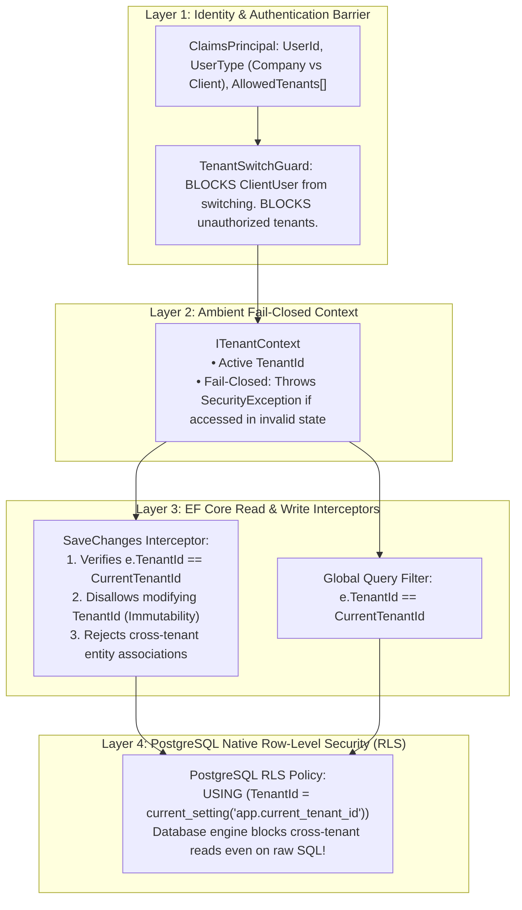
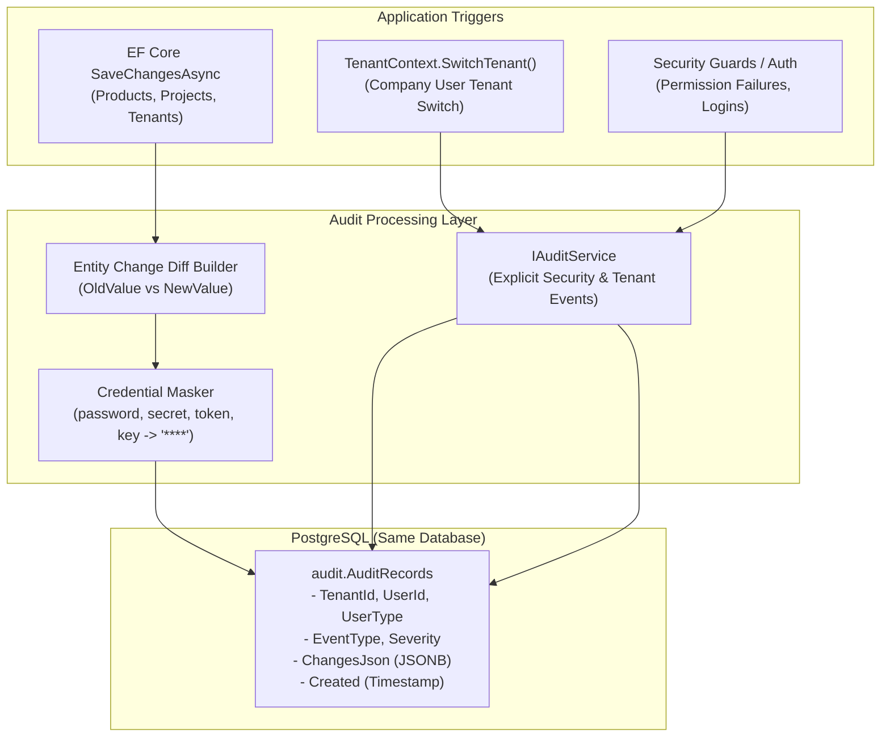
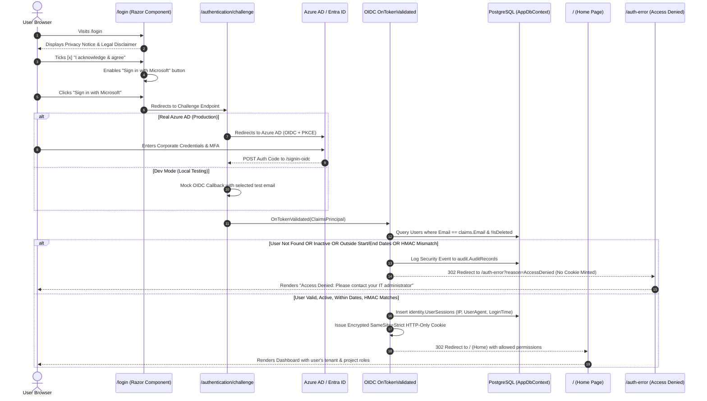

<div align="center">

# ⚡ BlazorFluent .NET 10 Starter Kit


## Observability & Request Logging
BlazorFluent leverages **Serilog** for structured logging across both Blazor circuits and HTTP pipelines:
- **Two-Stage Bootstrapping**: Early host initialization crashes are caught and flushed to the console before DI builds.
- **Circuit Lifecycle Observability**: `BlazorCircuitObservabilityHandler` tracks circuit startup, user disconnection, reconnection, and circuit-breaking exceptions.
- **HTTP Request Summaries**: `app.UseSerilogRequestLogging(...)` emits a single structured summary per request with `TenantId`, `UserId`, `ClientIp`, and latency.
- **Static Asset Noise Filter**: Static assets (`/_framework/*`, `/_content/*`, `.css`, `.js`, images, fonts) are demoted to `Verbose` to keep console and rolling daily log files (`logs/blazorfluent-.log`) clean and readable.

--------------------------
# Enterprise Tenant Security: Frameworks vs. Custom Architecture

This document addresses your critical security requirement: **protecting tenant boundaries with the highest rigor to prevent hacking, data breaches, and cross-tenant data leakage**, comparing existing popular .NET frameworks against a custom defense-in-depth architecture.

> [!IMPORTANT]
> **Strict Operational Rule**:
> The assistant will **NEVER** run `dotnet build`, `dotnet compile`, or `dotnet run`. All compilation, building, and running tasks will be performed exclusively by the **user** at the end.

---

## 1. The Real Threat Model: How Multitenant Breaches Happen

To evaluate frameworks vs. custom code, we must understand the actual attack vectors that lead to multitenant data breaches:

| Vulnerability Vector | How Attackers Exploit It | Does a Framework (like Finbuckle) Stop It? |
| :--- | :--- | :--- |
| **IDOR (Insecure Direct Object Reference)** | Attacker changes `ProjectId=123` to `ProjectId=456` in an API call or Blazor event to fetch another tenant's project. | ⚠️ **Only if** developer remembers to filter by tenant in query. |
| **Cross-Tenant Write Tampering** | Attacker sends an update payload altering `TenantId` to transfer an entity or create records inside another tenant. | ❌ **No**. Finbuckle has zero write-interception or tenant immutability protection. |
| **Bypassed Query Filter** | Developer runs raw SQL (`FromSqlRaw`, Dapper), uses `.IgnoreQueryFilters()`, or loads child navigation properties. | ❌ **No**. Application-level query filters are completely bypassed. |
| **Tenant Switching Privilege Escalation** | Client user tampers with headers (`X-Tenant-Id`) or cookies to impersonate another client's company. | ❌ **No**. Frameworks blindly resolve the header without verifying user-tenant authorization. |
| **Stale Blazor SignalR Circuits** | In Blazor Server, `HttpContext` drops after WebSocket handshake. Framework loses tenant context or falls back to host. | ❌ **No**. Causes unpredictable tenant leaks or runtime crashes. |

---

## 2. Custom Defense-in-Depth Architecture (Recommended)
- **What it is**: An enterprise security model used by top SaaS providers (Stripe, GitHub, Microsoft).
- **The Reality**:
  - Built on the principle of **Defense-in-Depth**: No single layer failure can cause a data breach.
  - **Layer 1 (Identity)**: Cryptographically verified user type (`CompanyUser` vs. `ClientUser`) and permitted tenant whitelist.
  - **Layer 2 (Context)**: Fail-closed ambient context (`ITenantContext`). If no tenant is active, all tenant data operations abort immediately.
  - **Layer 3 (EF Core Interceptor)**: Strict write-barrier preventing cross-tenant creation or updates, with immutable `TenantId`.
  - **Layer 4 (EF Core Query Filter)**: Automatic query isolation.
  - **Layer 5 (Optional Database Hardening)**: PostgreSQL Native **Row-Level Security (RLS)** — the database engine itself physically blocks cross-tenant reads even if an attacker executes raw SQL!




---

## 4. How the Custom Security Architecture Prevents Breaches

### 1. Stopping Cross-Tenant Write Attacks (Interceptor Level)
```csharp
// In AuditableEntityInterceptor:
if (entry.Entity is ITenantEntity tenantEntity)
{
    if (entry.State == EntityState.Added)
    {
        // Fail-closed: Cannot save a tenant entity without an active tenant
        if (string.IsNullOrWhiteSpace(_tenantContext.TenantId) && !_tenantContext.IsHost)
        {
            throw new SecurityException("CRITICAL: Attempted to insert a tenant entity without an active tenant context.");
        }

        // Auto-assign or verify matches active tenant
        if (string.IsNullOrWhiteSpace(tenantEntity.TenantId))
        {
            tenantEntity.TenantId = _tenantContext.TenantId!;
        }
        else if (tenantEntity.TenantId != _tenantContext.TenantId && !_tenantContext.IsHost)
        {
            throw new SecurityException($"CRITICAL: Cross-tenant write detected! Entity has TenantId '{tenantEntity.TenantId}', but session is '{_tenantContext.TenantId}'.");
        }
    }
    else if (entry.State == EntityState.Modified)
    {
        // TenantId is IMMUTABLE. Once written, it can never be changed.
        entry.Property(nameof(ITenantEntity.TenantId)).IsModified = false;

        var originalTenant = (string)entry.Property(nameof(ITenantEntity.TenantId)).OriginalValue!;
        if (originalTenant != _tenantContext.TenantId && !_tenantContext.IsHost)
        {
            throw new SecurityException($"CRITICAL: Cross-tenant modification detected! Record belongs to '{originalTenant}', but session is '{_tenantContext.TenantId}'.");
        }
    }
}
```

### 2. Stopping Tenant-Switching Hacking (Context Level)
```csharp
public Result SwitchTenant(string newTenantId)
{
    // Client users are HARD-BLOCKED at the domain level
    if (UserType == UserType.ClientUser)
    {
        return Result.Failure("SECURITY VIOLATION: Client users are strictly prohibited from switching tenants.");
    }

    // Company users can only switch to tenants they are authorized to access
    if (!IsHost && !AllowedTenants.Any(t => t.Id == newTenantId))
    {
        return Result.Failure($"SECURITY VIOLATION: User is not authorized to access tenant '{newTenantId}'.");
    }

    _activeTenantId = newTenantId;
    return Result.Success();
}
```

### 3. Ultimate Breach Protection: PostgreSQL Row-Level Security (RLS)
For maximum data breach prevention against SQL injection, Dapper leaks, or reporting bugs:
In PostgreSQL:
```sql
-- Enable Row Level Security on all tenant tables
ALTER TABLE catalog."Products" ENABLE ROW LEVEL SECURITY;

-- Create policy that enforces tenant matching
CREATE POLICY tenant_isolation_policy ON catalog."Products"
    FOR ALL
    USING ("TenantId" = current_setting('app.current_tenant_id', true));
```
When `AppDbContext` opens a connection:
```sql
SET app.current_tenant_id = 'tenant-guid-here';
```
Even if an attacker finds an SQL injection vulnerability or executes raw queries, PostgreSQL will physically return 0 rows from other tenants!

IGlobalEntity (Crucial): Protects your #1 security priority. It switches your EF Core filters from opt-in to default-on. If a developer adds a new entity tomorrow and forgets the tenant base class, EF Core will still isolate it automatically. Only entities explicitly marked IGlobalEntity (like TenantEntity itself) bypass the filter.
--------------------------
# Implementation Plan: Detailed Forensic Auditing (Level 2 & 3)

## 1. Goal Description

Implement a comprehensive, enterprise-grade auditing system in **BlazorFluent** targeting the **same PostgreSQL database under a dedicated `audit` schema** with **indefinite retention**.

This elevates auditing from **Level 1** (basic row stamps `Created`/`Updated`) to:
1. **Level 2 (Property-Level Entity Diffs)**: Automatic before-and-after property change capture in JSON format on every EF Core `Insert`, `Update`, and `Delete`, with automated masking of credentials, tokens, and secrets.
2. **Level 3 (Security & Activity Trail)**: Explicit logging of tenant switches, login/permission events, and critical user operations.

---

## 2. User Review Required

> [!IMPORTANT]
> **Transactional vs. Decoupled Auditing**:
> Entity change audits are captured directly within the same database transaction in the `audit.AuditRecords` table. This ensures 100% transactional consistency (if a database save fails or rolls back, phantom audit records are never saved).

> [!NOTE]
> **Schema Isolation**:
> The `audit.AuditRecords` table lives in its own PostgreSQL schema (`audit`), keeping application domain tables (`catalog`, `tenancy`) clean and uncluttered.

---

## 3. Architecture & Data Flow



------------------------------------------

# Implementation Plan: Caching Architecture Specification (L1 vs. L2 & README Documentation)

## Goal Description
Document and clarify the precise mechanics of **L1 (In-Process Memory)** vs. **L2 (Distributed Cache - Redis / Memory Fallback)** within the BlazorFluent architecture, including:
1. Exactly what data is stored in L1 vs. L2.
2. How .NET 10 `HybridCache` coordinates synchronization, serialization, and invalidation between L1 and L2 across auto-scaled Azure Web App instances.
3. An explicit inventory of cached items vs. non-cached business items.
4. A copy-ready, production-grade section to be integrated into `README.md`.

---

## User Review Required

> [!NOTE]
> **How HybridCache Coordinates L1 and L2**:
> In .NET 10 `HybridCache`, every cached item exists in **both** L1 and L2, but with fundamentally different representations, lifetimes, and purposes:
> - **L1 (In-Process RAM)** stores **live C# object references** in local instance memory for **sub-microsecond access**.
> - **L2 (Distributed Tier)** stores **serialized binary/JSON payloads** in Redis (or shared memory) with longer TTLs, serving as the **single source of truth** across auto-scaled instances and the **pub/sub invalidation backplane**.

---

## L1 vs. L2 Deep-Dive Specification

| Dimension | L1: In-Process Memory Cache | L2: Distributed Cache (Redis / Valkey) |
| :--- | :--- | :--- |
| **Location** | Local RAM of the specific Azure Web App node | Remote shared Redis instance (or in-memory fallback for local dev) |
| **Storage Format** | Unserialized live .NET object instances | Serialized binary / JSON byte buffers |
| **Access Latency** | **~50 to 100 nanoseconds** (Zero network hops, zero deserialization) | **~0.5 to 1.5 milliseconds** (Network round-trip across same Azure VNet) |
| **Default Lifetime** | Short (`LocalCacheExpirationMinutes = 15`) | Longer (`DefaultExpirationMinutes = 60`) |
| **Scope** | Private to the current instance and circuit | Shared across all auto-scaled Azure instances |
| **Eviction Mechanism** | Local TTL expiration OR instant eviction via Redis Pub/Sub message | Absolute TTL, LRU eviction, or atomic tag invalidation (`RemoveByTagAsync`) |

---

## Data Inventory: What is Cached vs. Excluded

### 1. Cached Payloads (Infrastructure Hotspots Only)

| Cache Scope | Key Pattern | Payload Type | L1 TTL | L2 TTL | Invalidation Trigger |
| :--- | :--- | :--- | :---: | :---: | :--- |
| **Global (Host)** | `g:tenants:all` | `IReadOnlyList<TenantEntity>` (Slug, DisplayName, StartDate, EndDate, IsActive) | 15 min | 60 min | Tenant created, edited, dates changed, or status toggled |
| **Tenant-Scoped** | `t:{tenantId}:permissions:{userId}` | `IReadOnlyList<string>` (User permission claims & role grants) | 15 min | 60 min | User role change, permission revocation |
| **Tenant-Scoped** | `t:{tenantId}:settings` | `TenantSettingsDto` (Branding, theme colors, feature flags) | 15 min | 60 min | Tenant settings modified, or tenant deactivated |

### 2. Intentionally Non-Cached Payloads (Direct to PostgreSQL)

| Entity / Query | Why It Is Excluded From Cache |
| :--- | :--- |
| **Catalog Products (`ProductEntity`)** | High cardinality, search/filter variants, and pagination. Querying PostgreSQL with `.AsNoTracking()` takes **1-3ms**. Caching would introduce stale-data bugs without user-perceived gain. |
| **Audit Records (`AuditRecordEntity`)** | Write-heavy, chronological append-only audit stream. Caching audit tables is an anti-pattern. |
| **User Profile / Form Edits** | Interactive transactional updates; must always reflect the absolute latest state from the database. |

---

## Proposed Changes: Section to Append to `README.md`

Below is the exact documentation markdown to be added to `README.md`:

```markdown
------------------------------------------
# Multi-Tenant Caching Architecture (L1 vs. L2 & Azure Auto-Scaling)

BlazorFluent implements a high-performance, fail-closed multi-tenant caching architecture based on **.NET 10 HybridCache (`Microsoft.Extensions.Caching.Hybrid`)** and **FullStackHero surgical caching patterns**.

## 1. Two-Tier Cache Topology (L1 vs. L2)

```
                            Azure ARR Load Balancer
                                       │
                ┌──────────────────────┴──────────────────────┐
                ▼                                             ▼
       Azure Web App (Node 1)                        Azure Web App (Node 2)
  ┌───────────────────────────────┐             ┌───────────────────────────────┐
  │ L1 Cache: In-Process RAM      │             │ L1 Cache: In-Process RAM      │
  │ • Live C# object references   │             │ • Live C# object references   │
  │ • Latency: ~50-100 ns         │             │ • Latency: ~50-100 ns         │
  │ • TTL: 15 minutes             │             │ • TTL: 15 minutes             │
  └───────────────┬───────────────┘             └───────────────┬───────────────┘
                  │                                             │
                  │        Redis Invalidation Bus (Pub/Sub)     │
                  ├─────────────────────────────────────────────┤
                  │                                             │
                  ▼                                             ▼
  ┌─────────────────────────────────────────────────────────────────────────────┐
  │ L2 Cache: Azure Cache for Redis (or Valkey / DistributedMemoryCache in dev) │
  │ • Serialized shared byte payload                                            │
  │ • Latency: ~0.8-1.5 ms (intra-VNet)                                         │
  │ • TTL: 60 minutes                                                           │
  │ • Broadcasts real-time L1 eviction across all auto-scaled nodes              │
  └──────────────────────────────────────┬──────────────────────────────────────┘
                                         │
                                         ▼
  ┌─────────────────────────────────────────────────────────────────────────────┐
  │                 PostgreSQL (Azure Flexible Server / Local)                  │
  │ • Ground truth database with Tenant Isolation Filters                       │
  │ • DataProtectionKeys table (shared token encryption across all nodes)       │
  └─────────────────────────────────────────────────────────────────────────────┘
```

### L1 (In-Process Memory)
- **What is stored**: Unserialized, live C# object references residing directly in the web application's memory heap.
- **Speed**: **Sub-microsecond (<100 nanoseconds)**. Zero network hops, zero JSON/binary serialization overhead.
- **Lifecycle**: Managed by `LocalCacheExpirationMinutes` (default: 15 minutes). Evicted immediately if an invalidation message arrives via Redis.

### L2 (Distributed Tier)
- **What is stored**: Serialized byte payloads accessible to all application instances.
- **Speed**: **~0.5 to 1.5 milliseconds** within the same Azure VNet or AWS VPC.
- **Lifecycle**: Managed by `DefaultExpirationMinutes` (default: 60 minutes).
- **Dual-Mode Operation**:
  - **Local Development**: Defaults to `DistributedMemoryCache` ($0 external setup, no Redis required).
  - **Azure Production**: Supplying `ConnectionStrings:Redis` automatically turns on `StackExchangeRedisCache`.

---

## 2. What Is Cached vs. What Is Not

To avoid cache-invalidation bugs and stale-data hazards, BlazorFluent follows the **Surgical Caching Pattern**:

### ✅ What IS Cached (Infrastructure Hotspots Only)
1. **Global Tenant Directory (`g:tenants:all`)**:
   - The complete tenant metadata list (`TenantEntity`).
   - Queried during route resolution, tenant switching, and host management.
   - Evicted automatically on tenant creation, status change, or date update.
2. **Tenant Permissions & Claims (`t:{tenantId}:permissions:{userId}`)**:
   - Authorized roles and permission flags checked on every UI interaction.
   - Evicted when user permissions change.
3. **Tenant Customization (`t:{tenantId}:settings`)**:
   - Tenant branding, custom themes, and configuration flags.

### ❌ What is NOT Cached (Direct PostgreSQL Queries)
- **Business Entities (`Products`, `Orders`, etc.)**: Kept direct from PostgreSQL using EF Core `.AsNoTracking()`. PostgreSQL executes indexed queries in **1-3ms**, ensuring zero risk of stale business data.
- **Forensic Audit Trails (`audit.AuditRecords`)**: Strictly append-only write path; never cached.

---

## 3. Multi-Tenant Security & Atomic Eviction

1. **Fail-Closed Facade (`ITenantCacheService`)**:
   - Automatically prefixes keys: `t:{tenantId}:{key}`.
   - Throws `InvalidOperationException` immediately if tenant cache is invoked without an active `TenantId`.
2. **Atomic Tenant Eviction**:
   - Every tenant cache entry is automatically tagged with `tenant:{tenantId}`.
   - Deactivating a tenant immediately triggers:
     ```csharp
     await _cacheService.InvalidateTenantAsync(tenantId);
     ```
   - This atomically purges all cached entries for that tenant across all auto-scaled Azure instances simultaneously.

---

## 4. Azure Auto-Scaling Configuration Guide

1. **Enable Sticky Sessions (ARR Affinity)**:
   In Azure Portal: *App Service > Configuration > General settings > ARR affinity: On*.
2. **Configure Redis for L2 Sync**:
   In Azure Portal: *App Service > Configuration > Application settings*, add:
   `ConnectionStrings__Redis` = `<your-azure-cache-for-redis-connection-string>`
3. **PostgreSQL Data Protection (Zero Extra Cloud Cost)**:
   ASP.NET Core Data Protection encryption keys are stored in the PostgreSQL `DataProtectionKeys` table. When Azure auto-scales from 1 to $N$ instances, all instances share the same key ring and can decrypt each other's antiforgery tokens and authentication cookies seamlessly.
```

---
--------------------------------------------------------------------------------------------------------------

# Implementation Plan: Native Custom Batch Job Engine (Retries, Auditing, Cron & Fluent UI V5 Dashboard)

## Goal Description
This implementation provides:
1. **3 Automatic Retries with Exponential Backoff**: Transient failures are automatically retried up to 3 times (500ms, 1500ms, 3000ms) before flagging as failed.
2. **Persistent Job Execution History**: Stored in a single clean PostgreSQL table (`JobExecutionEntity`), eliminating continuous DB polling overhead.
3. **Forensic Auditing & Serilog Observability**: Integrates with `IAuditService` to record job completions, failures, and manual retry triggers with user attribution.
4. **Cron Scheduling via `Cronos`**: Standard cron expressions (e.g. `"0 2 * * *"`) parsed with the official, 50KB zero-dependency Microsoft-standard parser.
5. **Modern Fluent UI Blazor V5 Dashboard (`/jobs`)**:
   - Live execution grid with status badges (`BadgeColor.Success`, `BadgeColor.Severe`, `BadgeColor.Warning`).
   - Execution duration, attempt counts (`1/3`, `3/3`), and stack trace inspection.
   - **Manual "Retry" Button** for failed jobs and a **"Run Now"** trigger for immediate on-demand execution.

# Background Jobs Architecture (Resilience, Cron Scheduling & Fluent UI V5 Dashboard)

BlazorFluent includes an ultra-lightweight, zero-dependency background batch job engine built natively on **System.Threading.Channels**, **Cronos**, and **EF Core**, avoiding the heavy database polling churn and licensing complexities of external job orchestrators.

## 1. Architecture & Execution Flow

```
   Cron Trigger (Cronos)      Manual UI Trigger ("/jobs")      Domain Event
             │                             │                         │
             └──────────────────────┬──────┴─────────────────────────┘
                                    │
                                    ▼
                      ┌───────────────────────────┐
                      │    IJobEventQueue         │
                      │ (Bounded Channel<IJobEvent)
                      └─────────────┬─────────────┘
                                    │
                                    ▼
                      ┌───────────────────────────┐
                      │  BatchJobQueueListener    │
                      │  - Scoped DI Activation   │
                      │  - ITenantContext Restore │
                      │  - 3 Retries + Backoff    │
                      └───────┬───────────┬───────┘
                              │           │
             Success / Failure│           │ Audit & Log
                              ▼           ▼
        ┌──────────────────────────┐  ┌──────────────────────────┐
        │   JobExecutionEntity     │  │  IAuditService / Serilog │
        │  (PostgreSQL Table)      │  │  - Forensic Security Log │
        │  - Status, Attempts, Err │  │  - Enriched with JobId   │
        └─────────────┬────────────┘  └──────────────────────────┘
                      │
                      ▼
        ┌──────────────────────────┐
        │  JobsDashboard.razor     │
        │  Route: "/jobs"          │
        │  - Fluent UI V5 Grid     │
        │  - Manual "Retry" Button │
        │  - "Run Now" Trigger     │
        └──────────────────────────┘
```

### Key Architectural Strengths
- **Zero Database Polling**: Unlike Hangfire (which executes continuous `SELECT ... FOR UPDATE` queries 24/7), this engine sleeps until an event is pushed or a Cron trigger fires, preserving PostgreSQL IOPS and CPU on Azure.
- **Tenant Isolation Preserved**: The listener automatically extracts `jobEvent.TenantId` and rehydrates `ITenantContext` into the background `IServiceScope`, guaranteeing that EF Core global query filters and audit stamps apply correctly.

---

## 2. Transient Retries & Backoff Policy

Every batch job execution automatically attempts up to **3 executions** before flagging as permanently failed:
- **Attempt 1**: Executes immediately upon dequeue.
- **Attempt 2**: If Attempt 1 throws an unhandled exception, marks status as `Retrying`, waits **500ms**, and re-executes.
- **Attempt 3**: If Attempt 2 fails, waits **1,500ms** (exponential backoff) and re-executes.
- **Fatal Failure**: If all 3 attempts fail, records the full exception message, sets status to `Failed`, and logs a high-severity audit record in `audit.AuditRecords`.

---

## 3. Cron Scheduling Configuration

Schedules are defined using standard Cron expressions via the lightweight `Cronos` library in `appsettings.json`:

```json
{
  "Jobs": {
    "EnableScheduler": true,
    "Schedules": {
      "TenantHealthCheckJob": "0 2 * * *",
      "AuditLogMaintenanceJob": "0 3 * * 0"
    }
  }
}
```

---

## 4. Fluent UI V5 Dashboard (`/jobs`)

Located under **Administration > Background Jobs** in the navigation menu:
- **Summary Cards**: Displays live totals for Succeeded (`BadgeColor.Success`), Failed (`BadgeColor.Severe`), and In-Progress/Retrying (`BadgeColor.Warning`).
- **DataGrid**: Lists Job Name, Tenant, Trigger Source, Started At, Duration, and Attempt count (`1/3`, `3/3`).
- **Manual "Retry" Button**: If any job fails, an admin can click **"Retry"** directly in the grid to re-enqueue and re-execute the job with fresh tracking.
- **"Run Now" Trigger**: Allows triggering registered jobs on-demand outside of their standard Cron schedule.
- **Error Stack Trace Inspection**: Click "Details" on any failed row to view the full error message and exception trace.
```

-------------------------------------------------------------------------------------

## Error Handling, Logging & Atomic Transactions

BlazorFluent enforces end-to-end exception containment, structured audit tracking, and database transaction consistency:

### 1. Blazor Circuit Error Boundary (`AppErrorBoundary`)
- Wraps application content in `MainLayout.razor` to catch unhandled component rendering exceptions.
- Keeps the SignalR circuit alive and prevents white-screen crashes.
- Renders a sanitized Fluent UI V5 error card displaying a unique incident reference code (`ERR-XXXXXX`).
- Never exposes internal stack traces, connection strings, or table names to clients.

### 2. Forensic Exception Auditing (`audit.AuditRecords`)
- Exceptions are automatically captured and recorded into PostgreSQL table `audit.AuditRecords` under `AuditEventType.Exception`.
- Stores the full exception type, message, stack trace, and inner exceptions in `ChangesJson`.
- Associated with the active `TenantId`, `UserId`, `TraceId` (Incident Reference), and timestamp.
- Accessible directly to host administrators in the **Audit Trail Explorer** (`/auditing`).
- Uses an isolated DB execution scope to guarantee error records are persisted even if the business transaction was rolled back.

### 3. Atomic Database Transactions (`IUnitOfWork`)
- Multi-step database workflows are wrapped using `IUnitOfWork.ExecuteInTransactionAsync(...)`.
- **All-or-Nothing Guarantee**: If any step fails or an exception is thrown, all pending database writes in the flow are rolled back, and the EF Core `ChangeTracker` is cleared to prevent corrupted in-memory entity states.
- Returns a safe `Result.Failure("... Reference: ERR-XXXXXX")` to the calling page.

### 4. Structured Rolling File Logging (Serilog)
- All exceptions are mirrored to rolling daily log files (`logs/blazorfluent-.log`) with structured placeholders and enriched tenant/user context.


------------------------------------------

## Persistence & Data Isolation (PostgreSQL + EF Core 10)

BlazorFluent incorporates enterprise-grade persistence patterns inspired by FullStackHero:

- **Sequential UUIDv7**: All domain entities inherit from `BaseEntity` or `AuditableEntity` using native .NET 10 `Guid.CreateVersion7()`. Time-ordered sequential identifiers prevent B-Tree index page splitting in PostgreSQL.
- **EF Core 10 Named Query Filters**:
  - `QueryFilters.Tenant`: Automatically applied to all `ITenantEntity` instances (with host bypass).
  - `QueryFilters.SoftDelete`: Automatically applied to all `ISoftDeletableEntity` instances.
  - Queries can selectively ignore soft-delete via `.IgnoreQueryFilters(QueryFilters.SoftDelete)` without accidentally disabling multi-tenant isolation.
- **Automatic Soft-Delete Interceptor**: Calling `_dbContext.Remove(entity)` on any soft-deletable entity is automatically intercepted, converted to an `UPDATE` setting `IsDeleted = true`, and recorded in `audit.AuditRecords` with Level 2 property diffs.
- **Fail-Closed Tenancy Verification**: Startup model validation ensures every entity explicitly declares either `ITenantEntity` or `IGlobalEntity`.


-------------------------------------------------

### HTTP Security Headers Standard

All responses from the internet-facing Blazor WebApp are hardened at the ASP.NET Core pipeline boundary with zero third-party dependencies:

- **Clickjacking Protection**: `X-Frame-Options: SAMEORIGIN` disallows unauthorized framing while supporting same-origin workflows.
- **MIME Sniffing Prevention**: `X-Content-Type-Options: nosniff` forces browsers to adhere strictly to declared MIME types.
- **Referrer Privacy**: `Referrer-Policy: strict-origin-when-cross-origin` strips sensitive path/query info when leaving the origin.
- **Device Capabilities**: `Permissions-Policy: camera=(), microphone=(), geolocation=()` restricts access to hardware APIs.
- **Reflected XSS Filtering**: `X-XSS-Protection: 1; mode=block` maintains legacy browser safet

---------------------------------------------------------------------------
### Chained Batch Workflows & Correlation Tracking

Background batch jobs support in-process event chaining with zero external message broker dependencies (e.g., RabbitMQ):

- **Event-Driven Chaining**: When a batch step completes, its handler directly enqueues the next step's event via `IJobEventQueue.EnqueueAsync(nextEvent)`.
- **Correlation Tracking**: Every `IJobEvent` and `JobExecutionEntity` carries a `CorrelationId` and an optional `ParentExecutionId`. All chained steps share the same `CorrelationId` across Serilog logs, PostgreSQL execution records, and audit events.
- **Jobs Dashboard**: Chained jobs and their correlation IDs are directly visible on `/jobs`, allowing operators to trace multi-step pipelines and inspect individual step details or trigger manual retries..


----------------------------------------------------------------------------------

## Project-Level Role Authorization & Defense-in-Depth

 Refer RoleAuth.md


 -------------------------------------------------------------------------------

 ## 12. Enterprise Identity: Login Flow, Active Sessions & Operator Impersonation

BlazorFluent incorporates enterprise-grade identity protections adapted from FullStackHero (FSH) principles:

- **Corporate Login Portal (`/login`)**: Pinned Privacy Notice & Monitoring Disclosure with a mandatory acknowledgment checkbox disabling "Sign in with Microsoft" until accepted.
- **HMAC-SHA256 Row Integrity Seal**: Protects `UserEntity` dates (`StartDateUtc`, `EndDateUtc`) and active status from direct database tampering. If a DBA modifies dates directly in PostgreSQL, the signature fails closed, rejects login, and logs a security incident in `audit.AuditRecords`.
- **Minimal Auth Error Screen (`/auth-error`)**: Renders *"Access Denied: Please contact your IT administrator."* when account validity or date windows fail.
- **Active User Sessions (`/admin/sessions`)**: Real-time tracking of active circuits with IP address, browser/device info, and an administrative "Kill Session" button that freezes the client circuit instantly via `<SessionRevokedModal />`.
- **Operator Impersonation**: Time-bound (60m auto-expiry) troubleshooting impersonation for SuperAdmins with a persistent warning banner (`<ImpersonationBanner />`) and shadow audit trails (`UpdatedBy = "{Target} [Impersonated by {Admin}]"`).


# Implementation Plan: Enterprise Login Flow, Date Validity, Active Sessions & Impersonation

## 1. Goal Description

This implementation plan provides a complete, production-ready enterprise authentication and identity lifecycle for BlazorFluent:

1. **Dedicated Corporate Login Page (`/login`)**:
   - Branded Fluent UI V5 card layout.
   - **Privacy Notice & Legal Monitoring Disclosure**: "This system is monitored for security compliance. Unauthorized access is prohibited."
   - **Mandatory Agreement Checkbox**: The "Sign in with Microsoft" button remains disabled until the user explicitly checks *"I acknowledge and agree to the Privacy Policy and Monitoring Notice"*.
   - **Dual-Mode Authentication**:
     - *Production*: Redirects to corporate Azure AD (Entra ID) via OpenID Connect + PKCE.
     - *Development*: Provides a dev switch to test valid, expired, and unprovisioned users without requiring a live Azure subscription.

2. **Backend Database Validity Gate (`OnTokenValidated`)**:
   - When Azure AD authenticates the user, ASP.NET Core checks their validity against PostgreSQL before issuing any session cookie:
     - Does the user exist in `Users`?
     - Is `IsActive == true`?
     - Is `DateTime.UtcNow >= StartDateUtc && DateTime.UtcNow <= EndDateUtc`?
     - Does the **HMAC-SHA256 Row Integrity Seal** match (anti-tamper protection)?
   - **If Valid**: Creates an encrypted HTTP-only session cookie (via PostgreSQL Data Protection), records an active `UserSessionEntity`, and redirects to `/` (Home) with full tenant and project roles loaded.
   - **If Failed**: Rejects authentication, logs a forensic security event in `audit.AuditRecords`, issues zero cookies, and redirects to `/auth-error`.

3. **Minimal Auth Error Page (`/auth-error`)**:
   - Clean, minimal Fluent UI card:
     - `"Access Denied: Please contact your IT administrator."`
     - Clean explanation (account inactive, access window expired, or unprovisioned).
     - `"Return to Login"` button.

4. **Active User Sessions & Real-Time Circuit Revocation (`UserSessionEntity`)**:
   - Tracks active sessions (IP address, user-agent, login time, last activity) in `identity.UserSessions`.
   - Host Administrators can view all live sessions at `/admin/sessions`.
   - Clicking **"Revoke Session"** broadcasts a revocation signal via `HybridCache`. The target user's active Blazor circuit freezes in real time with an unclosable **"Session Revoked"** modal and disconnects.

5. **Operator / Support Impersonation (`ImpersonationGrantEntity`)**:
   - Allows SuperAdmins to temporarily view the application *as a specific user* to troubleshoot issues within that user's exact tenant and project constraints.
   - Enforced by a **strict 60-minute auto-expiry** and mandatory reason logging.
   - Renders a persistent, inescapable warning banner at the top of every page (`⚠️ You are currently impersonating John Doe [Exit Impersonation]`).
   - Every mutation made during impersonation shadows the audit trail (`ImpersonatedBy = adminId`) in `audit.AuditRecords`.

---

## 2. End-to-End Authentication Sequence



---
## Enterprise Hardening: Security, Observability & Reusability

### 1. 15 ASP.NET Core Security Concepts Matrix

| # | Concept | Mechanism & Implementation |
|---|---|---|
| 1 | **Authentication** | Azure AD federated login, HMAC row-integrity seal on `UserEntity`, mandatory Privacy Notice agreement (`/login`). |
| 2 | **Authorization** | Dual `DefaultPolicy` and `FallbackPolicy` requiring authenticated users, multi-tenant & project role gates (`ProjectRole`), and `PathAwareAuthorizationHandler`. |
| 3 | **HTTPS & Transport** | Automatic HTTPS redirection, HSTS 30-day headers in production, and `ForwardedHeaders` (X-Forwarded-For, X-Forwarded-Proto) for cloud reverse proxies. |
| 4 | **Input Validation** | Declarative `FluentValidation` validators in `BlazorFluent.Core.Validation`, auto-registered in DI and consumed in Razor components with `<FluentValidationValidator />`. |
| 5 | **SQL Injection** | Parameterized queries enforced uniformly across EF Core 10 & PostgreSQL. Raw SQL string concatenation is prohibited. |
| 6 | **CORS** | N/A for Blazor Server monolith; all UI state is negotiated via same-origin SignalR WebSockets. |
| 7 | **CSRF / Anti-Forgery** | ASP.NET Core `app.UseAntiforgery()` enabled for form postbacks and circuit establishment. |
| 8 | **Rate Limiting** | `Microsoft.AspNetCore.RateLimiting` fixed-window limiter (10 req/min per IP) on `/login` via `[EnableRateLimiting("login")]`. |
| 9 | **Secure Cookies** | Global policy in `Program.cs`: `HttpOnly = Always`, `Secure = Always`, `SameSite = Strict`. |
| 10 | **Secrets Management** | Dual-tier setup: `dotnet user-secrets` for local dev; Azure Key Vault (`Azure.Identity.DefaultAzureCredential`) for production. |
| 11 | **Security Headers & CSP** | Strict edge headers in `SecurityHeadersExtensions`: X-Frame-Options, X-Content-Type-Options, Referrer-Policy, Permissions-Policy, X-XSS-Protection, and a Blazor Server-safe `Content-Security-Policy`. |
| 12 | **Error Handling** | Hardened `/Error` and `AppErrorBoundary` displaying sanitized `ERR-XXXXXXXX` incident references to users while recording full forensics in PostgreSQL `audit.AuditRecords` and Serilog. |
| 13 | **Secure Logging** | Sensitive keyword masking (`password`, `token`, `secret`, `key`) in `AuditableEntityInterceptor`, structured Serilog logging, and no sensitive parameter logging in EF Core. |
| 14 | **Data Protection** | Clustered keyring persisted to PostgreSQL (`PersistKeysToDbContext<AppDbContext>`) for auto-scaled Azure Web Apps and Container Apps. |
| 15 | **Dependency Security** | `Directory.Build.props` repo-wide `NuGetAudit` scanning direct and transitive packages, plus `.github/dependabot.yml` automated PRs. |

### 2. Observability & Health Probes

- **Liveness Probe**: `GET /healthz` — Unauthenticated probe checking process liveness without database overhead (returns `200 Healthy`).
- **Readiness Probe**: `GET /health/ready` — Unauthenticated probe verifying PostgreSQL database connectivity via `AddDbContextCheck<AppDbContext>` (returns `200 Healthy` or `503 Unhealthy`).
- **OpenTelemetry & Azure Monitor**: Direct trace and metric export via `Azure.Monitor.OpenTelemetry.AspNetCore`.
- **Serilog Trace Correlation**: Serilog log entries are enriched with `TraceId` and `SpanId` using `Serilog.Enrichers.Span`.

### 3. Reusable UI Components (`Components/Common/`)

- `<PageHeader Title="..." Subtitle="..." />`: Standardized page title header with typography tokens and action button slot.
- `<ConfirmDialog Title="..." Message="..." OnConfirmed="..." />`: Accessible modal confirmation dialog for destructive actions (Revoke, Delete, Impersonate).
- `<EmptyState Title="..." Description="..." />`: Standardized empty data table indicator card.

### 4. Background Audit Log Purge

- **Job**: `AuditPurgeJobHandler` executed nightly at 2 AM UTC (`Jobs:Schedules:AuditPurgeJob: "0 2 * * *"`).
- **Execution**: Uses EF Core `ExecuteDeleteAsync` bulk deletion to remove `audit.AuditRecords` older than `Audit:RetentionDays` (default: 365 days) across all tenants without memory overhead.


### 5. Advanced Resource Authorization, Input Sanitization & DAST Pipeline
- **Resource-Based Authorization**: Evaluates permissions dynamically against entity instances using `IAuthorizationService.AuthorizeAsync(User, resource, requirement)` backed by `ProjectResourceAuthorizationHandler`.
- **Input Sanitization**: `IInputSanitizer` (`Ganss.Xss.HtmlSanitizer`) strips script injection and malicious HTML tags from user text inputs before storage.
- **Automated DAST Pipeline**: `.github/workflows/owasp-zap-scan.yml` boots the application host in CI and executes automated OWASP ZAP baseline vulnerability scans.


-----------------------------------

### 6. Enterprise Blazor Framework Enhancements

- **Form Draft Auto-Save**: `ILocalStorageFormService` (`ProtectedLocalStorageFormService`) encrypts and stores uncommitted form drafts in browser `localStorage` using Data Protection keyrings.
- **Unsaved Changes Navigation Guard**: `<FormNavigationGuard IsDirty="..." />` uses `NavigationManager.RegisterLocationChangingHandler` to prompt users before discarding uncommitted form edits.
- **Responsive Layout Breakpoints**: `ILayoutBreakpointService` (`LayoutBreakpointService`) detects real-time browser viewport dimensions (`Mobile`, `Tablet`, `Desktop`) via JS interop.
- **State Persistence**: `PersistentStateComponentBase` wraps .NET 10 `PersistentComponentState` to seamlessly preserve component state across circuit pause/resume cycles.


--------------------------------------------

## 💾 EF Core Security, Performance & Domain Enhancements

- **Strongly-Typed DB Exception Translation**: `EntityFramework.Exceptions.PostgreSQL` automatically maps database constraint errors to strongly-typed C# exceptions (`UniqueConstraintException`, `ForeignKeyConstraintException`, `CannotInsertNullException`, `MaxLengthExceededException`), enabling clean user feedback without exposing raw stack traces.
- **Keyset (Cursor) Pagination**: `KeysetPaginationExtensions` provides $O(1)$ cursor pagination (`WHERE id > lastId LIMIT pageSize + 1`) for high-volume multi-tenant grid components.
- **EF Core 10 `ComplexType` Value Objects**: Inline value object mapping (`[ComplexType] Address`) without shadow primary keys or extra join tables.
- **Native LINQ LeftJoin Extension**: Clean syntax for left outer joins (`QueryableExtensions.LeftJoin`) avoiding nested `GroupJoin` / `DefaultIfEmpty()` boilerplate.