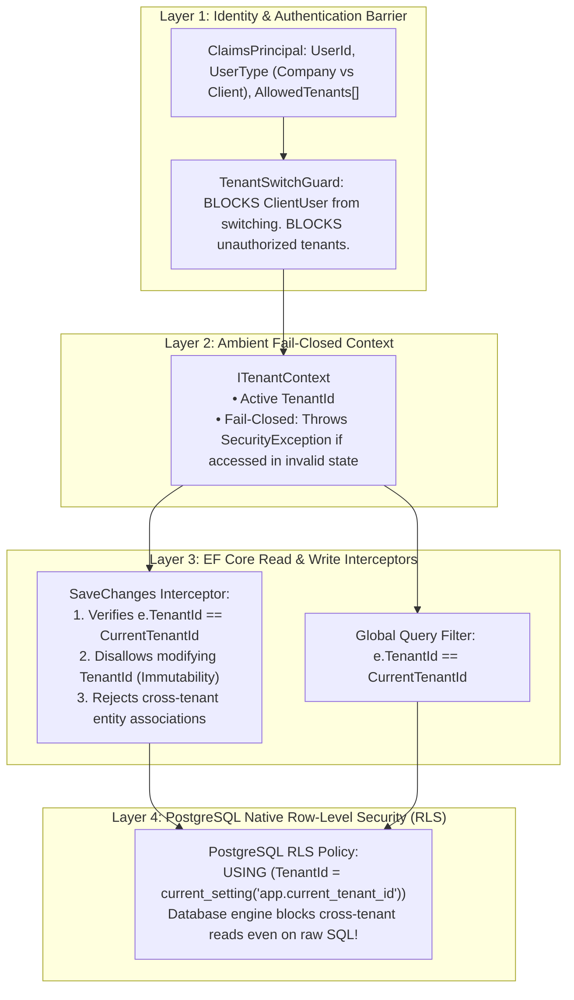
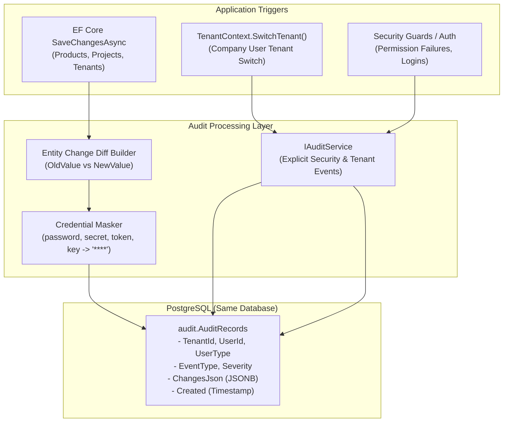

<div align="center">

# ⚡ BlazorFluent .NET 10 Starter Kit


--------------------------
# Enterprise Tenant Security: Frameworks vs. Custom Architecture

This document addresses your critical security requirement: **protecting tenant boundaries with the highest rigor to prevent hacking, data breaches, and cross-tenant data leakage**, comparing existing popular .NET frameworks against a custom defense-in-depth architecture.

> [!IMPORTANT]
> **Strict Operational Rule**:
> The assistant will **NEVER** run `dotnet build`, `dotnet compile`, or `dotnet run`. All compilation, building, and running tasks will be performed exclusively by the **user** at the end.

---

## 1. The Real Threat Model: How Multitenant Breaches Happen

To evaluate frameworks vs. custom code, we must understand the actual attack vectors that lead to multitenant data breaches:

| Vulnerability Vector | How Attackers Exploit It | Does a Framework (like Finbuckle) Stop It? |
| :--- | :--- | :--- |
| **IDOR (Insecure Direct Object Reference)** | Attacker changes `ProjectId=123` to `ProjectId=456` in an API call or Blazor event to fetch another tenant's project. | ⚠️ **Only if** developer remembers to filter by tenant in query. |
| **Cross-Tenant Write Tampering** | Attacker sends an update payload altering `TenantId` to transfer an entity or create records inside another tenant. | ❌ **No**. Finbuckle has zero write-interception or tenant immutability protection. |
| **Bypassed Query Filter** | Developer runs raw SQL (`FromSqlRaw`, Dapper), uses `.IgnoreQueryFilters()`, or loads child navigation properties. | ❌ **No**. Application-level query filters are completely bypassed. |
| **Tenant Switching Privilege Escalation** | Client user tampers with headers (`X-Tenant-Id`) or cookies to impersonate another client's company. | ❌ **No**. Frameworks blindly resolve the header without verifying user-tenant authorization. |
| **Stale Blazor SignalR Circuits** | In Blazor Server, `HttpContext` drops after WebSocket handshake. Framework loses tenant context or falls back to host. | ❌ **No**. Causes unpredictable tenant leaks or runtime crashes. |

---

## 2. Custom Defense-in-Depth Architecture (Recommended)
- **What it is**: An enterprise security model used by top SaaS providers (Stripe, GitHub, Microsoft).
- **The Reality**:
  - Built on the principle of **Defense-in-Depth**: No single layer failure can cause a data breach.
  - **Layer 1 (Identity)**: Cryptographically verified user type (`CompanyUser` vs. `ClientUser`) and permitted tenant whitelist.
  - **Layer 2 (Context)**: Fail-closed ambient context (`ITenantContext`). If no tenant is active, all tenant data operations abort immediately.
  - **Layer 3 (EF Core Interceptor)**: Strict write-barrier preventing cross-tenant creation or updates, with immutable `TenantId`.
  - **Layer 4 (EF Core Query Filter)**: Automatic query isolation.
  - **Layer 5 (Optional Database Hardening)**: PostgreSQL Native **Row-Level Security (RLS)** — the database engine itself physically blocks cross-tenant reads even if an attacker executes raw SQL!




---

## 4. How the Custom Security Architecture Prevents Breaches

### 1. Stopping Cross-Tenant Write Attacks (Interceptor Level)
```csharp
// In AuditableEntityInterceptor:
if (entry.Entity is ITenantEntity tenantEntity)
{
    if (entry.State == EntityState.Added)
    {
        // Fail-closed: Cannot save a tenant entity without an active tenant
        if (string.IsNullOrWhiteSpace(_tenantContext.TenantId) && !_tenantContext.IsHost)
        {
            throw new SecurityException("CRITICAL: Attempted to insert a tenant entity without an active tenant context.");
        }

        // Auto-assign or verify matches active tenant
        if (string.IsNullOrWhiteSpace(tenantEntity.TenantId))
        {
            tenantEntity.TenantId = _tenantContext.TenantId!;
        }
        else if (tenantEntity.TenantId != _tenantContext.TenantId && !_tenantContext.IsHost)
        {
            throw new SecurityException($"CRITICAL: Cross-tenant write detected! Entity has TenantId '{tenantEntity.TenantId}', but session is '{_tenantContext.TenantId}'.");
        }
    }
    else if (entry.State == EntityState.Modified)
    {
        // TenantId is IMMUTABLE. Once written, it can never be changed.
        entry.Property(nameof(ITenantEntity.TenantId)).IsModified = false;

        var originalTenant = (string)entry.Property(nameof(ITenantEntity.TenantId)).OriginalValue!;
        if (originalTenant != _tenantContext.TenantId && !_tenantContext.IsHost)
        {
            throw new SecurityException($"CRITICAL: Cross-tenant modification detected! Record belongs to '{originalTenant}', but session is '{_tenantContext.TenantId}'.");
        }
    }
}
```

### 2. Stopping Tenant-Switching Hacking (Context Level)
```csharp
public Result SwitchTenant(string newTenantId)
{
    // Client users are HARD-BLOCKED at the domain level
    if (UserType == UserType.ClientUser)
    {
        return Result.Failure("SECURITY VIOLATION: Client users are strictly prohibited from switching tenants.");
    }

    // Company users can only switch to tenants they are authorized to access
    if (!IsHost && !AllowedTenants.Any(t => t.Id == newTenantId))
    {
        return Result.Failure($"SECURITY VIOLATION: User is not authorized to access tenant '{newTenantId}'.");
    }

    _activeTenantId = newTenantId;
    return Result.Success();
}
```

### 3. Ultimate Breach Protection: PostgreSQL Row-Level Security (RLS)
For maximum data breach prevention against SQL injection, Dapper leaks, or reporting bugs:
In PostgreSQL:
```sql
-- Enable Row Level Security on all tenant tables
ALTER TABLE catalog."Products" ENABLE ROW LEVEL SECURITY;

-- Create policy that enforces tenant matching
CREATE POLICY tenant_isolation_policy ON catalog."Products"
    FOR ALL
    USING ("TenantId" = current_setting('app.current_tenant_id', true));
```
When `AppDbContext` opens a connection:
```sql
SET app.current_tenant_id = 'tenant-guid-here';
```
Even if an attacker finds an SQL injection vulnerability or executes raw queries, PostgreSQL will physically return 0 rows from other tenants!

IGlobalEntity (Crucial): Protects your #1 security priority. It switches your EF Core filters from opt-in to default-on. If a developer adds a new entity tomorrow and forgets the tenant base class, EF Core will still isolate it automatically. Only entities explicitly marked IGlobalEntity (like TenantEntity itself) bypass the filter.
--------------------------
# Implementation Plan: Detailed Forensic Auditing (Level 2 & 3)

## 1. Goal Description

Implement a comprehensive, enterprise-grade auditing system in **BlazorFluent** targeting the **same PostgreSQL database under a dedicated `audit` schema** with **indefinite retention**.

This elevates auditing from **Level 1** (basic row stamps `Created`/`Updated`) to:
1. **Level 2 (Property-Level Entity Diffs)**: Automatic before-and-after property change capture in JSON format on every EF Core `Insert`, `Update`, and `Delete`, with automated masking of credentials, tokens, and secrets.
2. **Level 3 (Security & Activity Trail)**: Explicit logging of tenant switches, login/permission events, and critical user operations.

---

## 2. User Review Required

> [!IMPORTANT]
> **Transactional vs. Decoupled Auditing**:
> Entity change audits are captured directly within the same database transaction in the `audit.AuditRecords` table. This ensures 100% transactional consistency (if a database save fails or rolls back, phantom audit records are never saved).

> [!NOTE]
> **Schema Isolation**:
> The `audit.AuditRecords` table lives in its own PostgreSQL schema (`audit`), keeping application domain tables (`catalog`, `tenancy`) clean and uncluttered.

---

## 3. Architecture & Data Flow



------------------------------------------