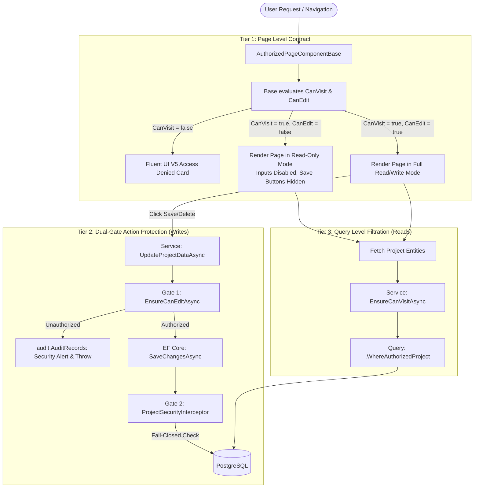

## Project-Level Role Authorization & Defense-in-Depth

BlazorFluent implements a 3-tier, fail-closed authorization architecture combining compile-time page contracts with service and database write guards:

1. **Lightweight Extensible Roles (`ProjectRole`)**:
   - `ReadOnly = 1`: View-only access to project data.
   - `QA = 2`: Read/write access for test and validation scenarios.
   - `Dev = 3`: Full read/write access for feature development.
   - `Admin = 4`: Full project control and team role management.

2. **Compile-Time Enforced Page Contract (`AuthorizedPageComponentBase`)**:
   - Any feature page must declare `MinimumVisitRole` and `MinimumEditRole`.
   - `CanVisit == false`: Displays a Microsoft Fluent UI V5 Access Denied card.
   - `CanVisit == true && CanEdit == false`: Renders in **Read-Only Mode** (inputs disabled, save/action buttons hidden).
   - `CanVisit == true && CanEdit == true`: Full read/write mode.

3. **Dual-Gate Action Protection (Writes)**:
   - **Gate 1 (Service Layer)**: Commands call `EnsureCanEditAsync(projectId)`. If unauthorized, records a forensic security audit entry and throws `UnauthorizedAccessException`.
   - **Gate 2 (EF Core Safety Net)**: `ProjectSecurityInterceptor` intercepts `SavingChangesAsync` and blocks any `Added`, `Modified`, or `Deleted` project entity (`IProjectScopedEntity`) if the user lacks `CanEdit`.

4. **Query Scoping (Reads)**:
   - Single-project queries verify `EnsureCanVisitAsync(projectId)`.
   - Multi-project queries apply `.WhereAuthorizedProject(userProjectIds)` so unauthorized project records never leave PostgreSQL.

5. **Instant Live Cache Invalidation**:
   - Permissions are cached in `HybridCache` under `proj_role_{tenantId}_{userId}_{projectId}` (~0ms L1 hits).
   - Assigning or revoking roles immediately invalidates the cache so changes apply instantly without requiring a re-login.

6. **Access Management Screen**:
   - Navigate to `/tenancy/project-roles` to select projects, view members, assign/edit roles, or revoke access.

---

## 3. Architecture & Data Flow

---